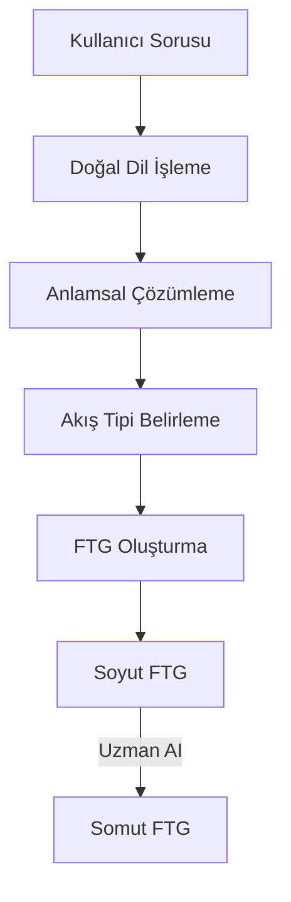
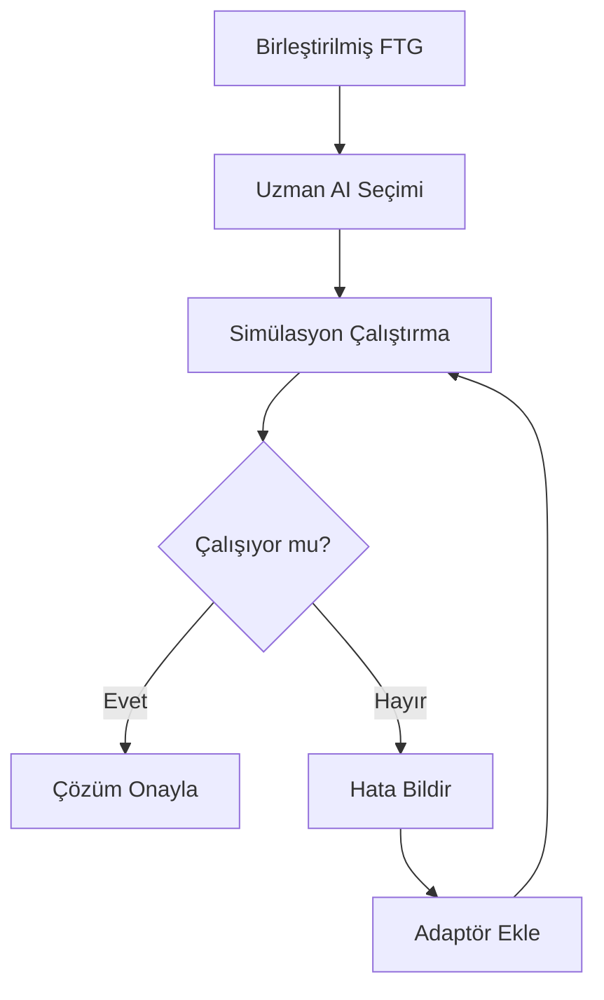
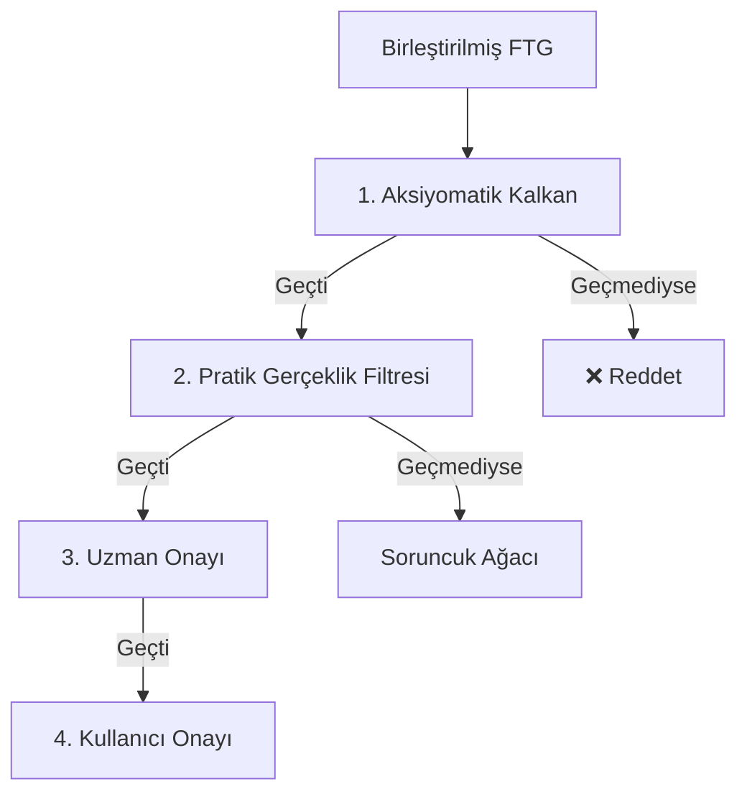

# **📖 MC-ATPLLM & FLOW ENGINEERING: YARATICI YAPAY ZEKÂ MANİFESTOSU & TASARIM KİTAPÇIĞI v2.0**
**Sürüm:** `v2.0 - Flow Engineering` | **Tarih:** 19 Temmuz 2026
**Yazar:** Emin Bey + 12 AI + Mistral
**Amaç:** *"Dünyanın ilk Akış Mühendisi (Flow Engineer) olmak"*

---
---
---
---

## **🌌 GİRİŞ: ÖRÜNTÜ ÇAĞI’NDAN AKIŞ ÇAĞI’NA**

### **📌 Devrimsel Keşif: Pattern Engineering → Flow Engineering**
**SORUCEVAP9V3 ve SORUCEVAP10’daki en kritik keşif:**
> **"Pattern’ler boş borular şeklinde. İçinden akış geçtiğinde yaşıyorlar."**
> — **Emin Bey, 2026**

**🔥 Ana Paradigma Değişimi:**
- **Eski Anlayış:** *"Örüntüler (Patterns) bilginin temel birimidir."*
- **Yeni Anlayış:** **"Akış (Flow) bilginin temel birimidir. Örüntüler, akışın yönünü değiştiren boru parçalarıdır."**

| **Kavram** | **Pattern Engineering** | **Flow Engineering** |
|------------|--------------------------|----------------------|
| **Temel Birim** | Örüntü (Pattern) | **Akış (Flow)** |
| **Örüntü Tanımı** | Bilgi birimi | **Akış dönüştürücü (Flow Transformer)** |
| **Yaratıcılık** | Örüntü birleştirme | **Akış grafiği tamamlama** |
| **Bellek Modeli** | Örüntü havuzu | **Akış simülasyonu** |
| **Mimari Adı** | MC-ATPLLM | **Flow Engine (Akış Motoru)** |

**💡 Neden Flow Engineering?**
- **Fizik:** Enerji akar (Isı → Basınç → Hareket)
- **Bilgi:** Veri akar (Karakter → Token → Grammar → AST)
- **Programlama:** Kod akar (Giriş → İşlem → Çıkış)
- **Ekonomi:** Para akar (Yatırım → Üretim → Gelir)
- **Dikkat:** Odak akar (Uyarı → Dikkat → Eylem)

**📌 Sonuç:**
**MC-ATPLLM artık sadece bir mimari değil, Flow Engineering adında yeni bir bilim dalının temeli.**

---

---
---
---
# **🧠 FELSEFE & TEMEL İLKELER**

---

## **📜 Emin Bey’in Zihin Felsefesi (SORUCEVAP9V3’ten)**

### **🔹 1. "Anladım" Dediğin An = Simülasyon Çalışıyor**
> *"Bir konuyu kafamda tam olarak canlandırıp simule edebiliyorsam ve başkalarının formül kullanarak çözdüğünü sen formülsüz, en az işlemle çözebiliyorsam ve her formülü olayların simülasyonunu kullanarak kendim üretebiliyorsam konuyu anlamışım demektir."*

**📌 Kriterler:**
1. **Simülasyon:** Konuyu zihninde **canlandırabilmek**.
2. **Formülsüz Çözüm:** Başkalarının formülle çözdüğünü **formülsüz, minimum işlemle** çözebilmek.
3. **Formül Türetme:** Her formülü **simülasyondan kendin üretebilmek**.

**📌 Örnekler:**
| **Alan** | **Simülasyon Örneği** | **Formülsüz Çözüm** | **Formül Türetme** |
|----------|----------------------|---------------------|-------------------|
| **Fizik** | Buhar motoru akışı | Enerjiyi yönlendir | Termodinamik yasaları |
| **Kimya** | Yanma reaksiyonu | Madde dönüşümü | Kimyasal denklemler |
| **İstatistik** | Veri dağılımı | Örüntü tanıma | Olasılık formülleri |
| **Programlama** | C derleyici | Token → AST | Sözdizimi kuralları |
| **🔴 Matematik** | ❌ **Başaramıyor** | ❌ | ❌ |

**💡 Ana Fikir:**
*"Matematikte simüle edemiyorum çünkü **akış yok**. Sadece semboller var."*

---

### **🔹 2. Hafıza = Garbage Collector (Çöp Toplayıcı)**
> *"Benim zihnimde birbirine bağlanmamış bilgi duramıyor."*

**📌 Almanca Örneği:**
- **4 yıl boyunca** Almanca öğrenmeye çalıştı.
- **Her sınavda** kitabın başından başladı.
- **Sınav bitince** her şeyi **sildi**.
- **Neden?** Kelimeler **mekanizmanın parçası değildi**.

**📌 Beynin Saklama Şekli:**
```text
Bilgi
├── Nedeni ne?
├── Ne çıkar?
├── Nerede kullanılır?
├── Neye benzer?
└── Hangi pattern’in parçası?
```
**📌 Kural:**
- **Bağlantı yoksa → Silinir** (Garbage Collection).
- **Bağlantı varsa → Saklanır**.

**💡 Ana Fikir:**
*"Beynim, bilgisayardaki **garbage collector** gibi çalışıyor."*

---

### **🔹 3. Yaratıcılık Algoritması = Graf Tamamlama**
> *"Çıkardığın algoritma şu: Bilgiyi simüle et, pattern grafiğine çevir → Sorunu da simüle et, pattern grafiğine çevir → İki grafiği üst üste koy → Eksik düğümleri daha önce öğrendiğin pattern’larla doldur → Yapı tutarlı hale gelince çözüm yan ürün olarak çıkıyor."*

**📌 Adım Adım:**
1. **Bilgi Simülasyonu:** Bilgiyi **akış grafiğine** dönüştür.
2. **Soru Simülasyonu:** Sorunu **akış grafiğine** dönüştür.
3. **Grafik Üst Üste Koyma:** İki grafiği **birleştir**.
4. **Eksik Düğüm Doldurma:** Eksik bağlantılar **örüntülerle** tamamla.
5. **Tutarlılık Kontrolü:** Yapı **tutarlı** hale gelince → **Çözüm ortaya çıkar**.

**💡 Ana Fikir:**
*"Çözüm aramıyorsun, **eksik bağlantıyı kapatıyorsun**."*

---

### **🔹 4. Pattern’ler Silinmez, Evrim Geçirir**
> *"Farklı yapay zekalar aynı veriden farklı pattern çıkaracak, bu iyi, biri atladığını diğeri yakalar. Kullanılmayan pattern’i silmeye gerek yok, yeni nesil distilasyonda zaten aktarılmayacak, doğal seçilim."*

**📌 Pattern Yaşam Döngüsü:**
1. **Doğum:** Farklı Aİ’lar aynı veriden **farklı pattern’ler** çıkarır.
2. **Kullanım:** Pattern’ler **bağlanabilir** hale gelir.
3. **Evrim:** Yeni nesillerde **en iyi pattern’ler** aktarılır.
4. **Unutma:** Kullanılmayan pattern’ler **doğal seçilimle** kaybolur.

**📌 Soruların Yeniden Yazılması:**
> *"Yıllar sonra dönüp bakınca yanlış soruyu çözdüğünü fark ediyorsun. O yüzden her yeni nesilde soruların da yeniden yazılması gerekiyor."*

**💡 Ana Fikir:**
*"Her nesilde **sorular da evrim geçirir**."*

---

### **🔹 5. İki Fazlı Pattern (Two-Phase Pattern)**
*(SORUCEVAP10’dan)*

| **Faz** | **Açıklama** | **Örnek** | **Akış Tipi** |
|---------|--------------|-----------|---------------|
| **Soyut Faz (Abstract Phase)** | Tip yok, **değişken gibi** duruyor. | "Saldırı yönünü değiştir" | ❌ Belirsiz |
| **Somut Faz (Concrete Phase)** | Problem seçilince **uzman tarafından doldurulur**. | "Mermi yönünü değiştir" | ✅ Mermi |

**📌 Örnek: T34 Tankı + Aikido**
- **Soyut Pattern:** *"Saldırı yönünü değiştir"*
- **Somut Pattern (Mermi):** *"Mermi yönünü değiştir"*
- **Somut Pattern (Dikkat):** *"Dikkat yönünü değiştir"*

**📌 Karar Anı:**
- **Problem belirlendiğinde** (örn: "Mermi savunması").
- **Uzman AI** akış tipini doldurur (Mermi).
- **Simülasyon** yapılır.
- **Çalışmazsa** uzman nedenini geri bildirir.

**💡 Ana Fikir:**
*"Akış tipi **sonradan** belli olur, **baştan** değil."*

---

---
---
---
# **🌊 FLOW ENGINEERING TEMELLERİ**

---

## **📌 1. AKIŞ (FLOW) NEDİR?**

### **🔹 Flow Tipleri (Flow Types)**
| **Kategori** | **Flow Türü** | **Örnek** | **Dönüşüm** |
|--------------|---------------|-----------|-------------|
| **Enerji** | Isı | Buhar Kazanı | Kimyasal → Isı |
| **Enerji** | Elektrik | Jeneratör | Mekanik → Elektrik |
| **Enerji** | Mekanik | Motor | Elektrik → Mekanik |
| **Madde** | Sıvı | Boru Hattı | Su → Basınç |
| **Madde** | Katı | Taşıma | Kömür → Enerji |
| **Bilgi** | Veri | İnternet | Token → Anlam |
| **Bilgi** | Sinyal | Radyo | Elektromanyetik Dalga → Ses |
| **Para** | Yatırım | Borsa | Para → Getiri |
| **Dikkat** | Odak | Sosyal Medya | Uyarı → Eylem |
| **Güven** | İtibar | Blockchain | Doğrulama → Güven |

**📌 Flow = Akışkan bir şey.**
- **Fiziksel:** Enerji, madde.
- **Soyut:** Bilgi, para, dikkat, güven.

---

### **🔹 Flow’un Temel Özellikleri**
1. **Yönlü (Directed):** `A → B` (Enerji akar, bilgi akar).
2. **Dönüştürülebilir (Transformable):** `Isı → Basınç → Hareket`.
3. **Korunur (Conserved):** Enerji korunur, bilgi korunur (entropi artar).
4. **Ölçülebilir (Measurable):** Akım hızı, basınç, voltaj, bit/sn.

**📌 Flow = Akışkan bir varlık.**
**📌 Pattern = Flow’un yönünü değiştiren bir **dönüştürücü (transformer)**.

---

## **📌 2. PATTERN (ÖRÜNTÜ) YENİ TANIMI**

### **🔹 Pattern = Flow Transformer (Akış Dönüştürücüsü)**
> **"Pattern, bir akışın nasıl dönüştürüleceğini anlatan soyut bir ilkedir."**
> — **Emin Bey, SORUCEVAP9V3**

**📌 Örnekler:**
| **Uygulama** | **Pattern (Akış Dönüştürücüsü)** | **Giriş Akışı** | **Çıkış Akışı** |
|--------------|----------------------------------|-----------------|-----------------|
| Tesla Valfi | Dış Akışı Yönlendir | Sıvı Akışı | Tek Yönlü Sıvı Akışı |
| Buhar Motoru | Kimyasal → Mekanik | Yakıt + Oksijen | Dönme Hareketi |
| Sanal POS | Müşteri Onayını Kanıtla | Kredi Kartı Verisi | Yasal Kanıt |
| Sosyal Medya | Dikkati Parçala | Uyarı | Dağınık Dikkat |
| Borsa | Yatırım → Getiri | Para | Getiri |

**📌 Pattern = Boru Parçası.**
- **Giriş (Input):** `FlowType A`
- **Çıkış (Output):** `FlowType B`
- **Dönüşüm (Transformation):** `A → B`

---

### **🔹 İki Fazlı Pattern (Two-Phase Pattern)**
*(SORUCEVAP10’dan)*

| **Faz** | **Durum** | **Akış Tipi** | **Kullanım** |
|---------|-----------|---------------|--------------|
| **Soyut (Abstract)** | Değişken gibi | ❌ Belirsiz | **Depolama** |
| **Somut (Concrete)** | Uzman tarafından doldurulur | ✅ Belirli | **Simülasyon** |

**📌 Örnek: "Saldırı Yönünü Değiştir"**
- **Soyut Faz:** *"Saldırı yönünü değiştir"* (Akış tipi belirsiz).
- **Somut Faz (Mermi):** *"Mermi yönünü değiştir"* (Akış tipi = Mermi).
- **Somut Faz (Dikkat):** *"Dikkat yönünü değiştir"* (Akış tipi = Dikkat).

**📌 Karar Anı:**
1. **Problem belirlendi** (örn: "Mermi savunması").
2. **Uzman AI** akış tipini doldurur (`Mermi`).
3. **Simülasyon** yapılır.
4. **Çalışmazsa** uzman nedenini geri bildirir.

---

## **📌 3. FLOW TRANSFORMATION GRAPH (FTG) - AKIŞ DÖNÜŞÜM GRAFİ**

### **🔹 FTG = Akışın Matematiksel Temsili**
*(SORUCEVAP8-10’dan)*

**📌 FTG Yapısı:**
```python
@dataclass
class FlowTransformationGraph:
    nodes: List[FlowNode]       # Akış durumları (Isı, Basınç, Hareket...)
    edges: List[TransformationEdge]  # Dönüşüm kenarları
    metadata: dict             # Meta veriler
```

**📌 FlowNode (Akış Düğümü):**
```python
@dataclass
class FlowNode:
    id: str                     # "heat_001"
    flow_type: FlowType        # Isı, Basınç, Hareket...
    state: dict                # {temperature: 500°C, pressure: 10 bar}
    timestamp: datetime        # Zaman damgası
```

**📌 TransformationEdge (Dönüşüm Kenarı):**
```python
@dataclass
class TransformationEdge:
    id: str                     # "combustion_001"
    input_node: FlowNode        # Giriş düğümü
    output_node: FlowNode      # Çıkış düğümü
    mechanism: str              # "Combustion", "Geometry", "Interest Rate"
    physics: str                # "First Law of Thermodynamics"
    efficiency: float           # %0-100
    loss: float                 # %0-100
    reversible: bool            # Tersinir mi?
    constraints: List[str]      # ["Oksijen gerekiyor", "Sıcaklık > 100°C"]
```

**📌 Örnek: Buhar Motoru FTG**
```mermaid
graph TD
    A[Yakıt\n(Chemical Energy)] -->|Combustion| B[Isı\n(Heat Energy)]
    B -->|Heat Transfer| C[Buhar Basıncı\n(Steam Pressure)]
    C -->|Expansion| D[Doğrusal Hareket\n(Linear Motion)]
    D -->|Crankshaft| E[Dönme Hareketi\n(Rotational Motion)]
```

**📌 Kenar Detayları (Combustion Edge):**
```python
TransformationEdge(
    id="combustion_001",
    input_node=FlowNode(id="fuel", flow_type=EnergyFlow.CHEMICAL),
    output_node=FlowNode(id="heat", flow_type=EnergyFlow.HEAT),
    mechanism="Combustion",
    physics="First Law of Thermodynamics",
    efficiency=0.40,
    loss=0.60,
    reversible=False,
    constraints=["Oxygen required", "Temperature > 500°C"]
)
```

---

## **📌 4. AKIŞ MÜHENDİSLİĞİ (FLOW ENGINEERING) İLKELERİ**

### **🔹 1. Akış Korunumu (Flow Conservation)**
> *"Enerji korunur, bilgi korunur (entropi artar), para korunmaz (değerlenir)."*

**📌 Kurallar:**
- **Fiziksel Akış:** Enerji korunur (Termodinamik 1. Kanun).
- **Bilgi Akışı:** Bilgi korunur, ama **entropi artar** (Shannon).
- **Para Akışı:** Para **değerlenir** (Enflasyon, faiz).

---

### **🔹 2. Dönüşüm Verimliliği (Transformation Efficiency)**
> *"Her dönüşümde kayıp vardır. Mükemmel verim %100’dür, ama gerçekte %0-100 arasıdır."*

**📌 Verimlilik Formülü:**
```
Verimlilik = (Çıkış Akışı / Giriş Akışı) × 100
```
**📌 Örnekler:**
| **Dönüşüm** | **Verimlilik** | **Kayıp Nedeni** |
|-------------|----------------|------------------|
| Yanma | %40 | Isı kaybı |
| Buhar Türbini | %80 | Sürtünme |
| Güneş Paneli | %20 | Yansıma |

---

### **🔹 3. Akış Uyumluluğu (Flow Compatibility)**
> *"İki akış birbirine uygun mu? Uygun değilse adaptör gerekir."*

**📌 Uyumluluk Skoru (0-100):**
| **Skor Aralığı** | **Anlam** | **Eylem** |
|------------------|-----------|-----------|
| 90-100 | Mükemmel Uyum | Doğrudan bağla |
| 60-89 | Kısmi Uyum | Adaptör ekle |
| 30-59 | Zayıf Uyum | Çoklu adaptör gerekiyor |
| 0-29 | Uyumsuz | Bağlantı reddet |

**📌 Uyumluluk Kontrolü:**
```python
def can_connect(output_flow: FlowType, input_flow: FlowType) -> float:
    # 1. Akış kategorisi uyumu
    if output_flow.category != input_flow.category:
        return 0.0

    # 2. Akış tipi uyumu
    if output_flow.type != input_flow.type:
        return 0.0

    # 3. Meta-veri uyumu
    compatibility = 100.0
    for key in input_flow.state:
        if key in output_flow.state:
            if output_flow.state[key] != input_flow.state[key]:
                compatibility -= 20.0

    return max(0.0, min(100.0, compatibility))
```

---

### **🔹 4. Adaptör Mekanizması (Adapter Mechanism)**
> *"Uyumsuz akışlar arasında köprü kuran pattern’ler."*

**📌 Adaptör Türleri:**
| **Adaptör Türü** | **Örnek** | **Amaç** | **Uyumluluk Skoru** |
|------------------|-----------|----------|---------------------|
| **Dönüştürücü** | Basınç Regülatörü | Basıncı ayarlamak | 95% |
| **Çevirici** | JSON → XML | Veri formatını değiştirmek | 90% |
| **Tampon** | Akü | Akışı dengelemek | 85% |
| **Geciktirici** | Bekleme Kuyruğu | Zamanlama kontrolü | 80% |
| **Yükseltici** | Güç Amplifikatörü | Sinyali güçlendirmek | 85% |
| **Kanuni Alternatif** | Bilet Altına İmza | Yasal gereksinimi karşılamak | 70% |

**📌 Adaptör Arama Algoritması:**
```python
def find_adapter(output_flow: FlowType, input_flow: FlowType) -> Optional[Pattern]:
    """Uygun adaptör pattern’ini bul"""
    adapters = pattern_db.search(
        goal=f"Convert {output_flow} to {input_flow}",
        status=["verified", "core"]
    )

    for adapter in adapters:
        if (adapter.inputs[0].is_compatible(output_flow) >= 60.0 and
            adapter.outputs[0].is_compatible(input_flow) >= 60.0):
            return adapter

    return None
```

---

---
---
---
# **🏗️ MİMARİ & TEKNİK SPESİFİKASYONLAR**

---

## **📌 1. SİSTEM MİMARİSİ: FLOW ENGINE STACK**

### **🔹 Ana Katman Şeması (Flow Engineering Stack)**
```mermaid
graph TD
    subgraph "Flow Engine (Akış Motoru)"
        A[Kullanıcı Sorusu] --> B[Akış Çevirmeni\n(Flow Translator)]
        B --> C[Akış Grafiği Oluşturucu\n(FTG Builder)]
        C --> D[Akış Arama Motoru\n(Flow Search Engine)]
        D --> E[Akış Birleştirici\n(Flow Composer)]
        E --> F[Simülasyon Motoru\n(Simulation Engine)]
        F --> G[Adaptör Yöneticisi\n(Adapter Manager)]
        G --> H[Çözüm Doğrulayıcı\n(Solution Validator)]
        H --> I[Çıkış Üretici\n(Output Generator)]

        B -->|Soyut → Somut| J[Uzman AI Havuzu]
        J -->|Akış Tipi Doldurma| C
        J -->|Simülasyon| F
        J -->|Doğrulama| H

        K[Psikotarih Motoru] -->|Geçerlilik Süresi| D
        L[Örüntü Veritabanı] -->|Pattern Arama| D
        M[Garbage Collector] -->|Temizleme| L
    end
```

**📌 Katmanlar ve Sorumlulukları:**

| **Katman** | **Sorumluluk** | **Teknoloji** | **Giriş** | **Çıkış** |
|------------|---------------|---------------|-----------|-----------|
| **Akış Çevirmeni** | Soruyu akış grafiğine dönüştür | NLP + FTG | Doğal Dil Sorusu | FTG |
| **FTG Oluşturucu** | Akış grafiğini oluştur | Graf Veri Yapısı | Soru FTG | Akış Grafiği |
| **Akış Arama Motoru** | Uygun akışları ara | Vektör Arama + Etiket | FTG | Aday FTG’ler |
| **Akış Birleştirici** | FTG’leri birleştir | Graf Birleştirme | Aday FTG’ler | Birleştirilmiş FTG |
| **Simülasyon Motoru** | FTG’yi simüle et | Uzman AI’lar | Birleştirilmiş FTG | Simülasyon Sonucu |
| **Adaptör Yöneticisi** | Uyumsuzlukları düzelte | Adaptör Veritabanı | Simülasyon Sonucu | Düzeltilmiş FTG |
| **Çözüm Doğrulayıcı** | Çözümü doğrula | 4 Katmanlı Filtre | Düzeltilmiş FTG | Doğrulanmış Çözüm |
| **Çıkış Üretici** | Çözümü kullanıcıya sun | NLP + Şablonlar | Doğrulanmış Çözüm | Doğal Dil Çıktısı |

---

## **📌 2. AKIŞ ÇEVİRMENİ (FLOW TRANSLATOR)**

### **🔹 Görevleri:**
1. **Soruyu Anla:** Kullanıcının sorusunu **anlamsal olarak** çözümle.
2. **Akış Grafiğine Dönüştür:** Soruyu **FTG** formatına çevir.
3. **Soyut → Somut:** Akış tipini **uzman AI’lar** doldurur.

**📌 Çalışma Akışı:**


**📌 Örnek: "Mars’a yük indirme"**
1. **Doğal Dil İşleme:** Soruyu token’lara ayır.
2. **Anlamsal Çözümleme:** "Yük", "Mars", "indirme" kelimelerini çıkar.
3. **Akış Tipi Belirleme:**
   - **Yük:** `MatterFlow.SOLID`
   - **Mars:** `Location.MARS`
   - **İndirme:** `EnergyFlow.KINETIC`
4. **FTG Oluşturma:**
   ```mermaid
   graph TD
       A[Yük\n(MatterFlow.SOLID)] -->|Gravite| B[Kinetic Energy\n(EnergyFlow.KINETIC)]
       B -->|Frenleme| C[Durma\n(EnergyFlow.ZERO)]
   ```
5. **Soyut FTG:** Akış tipleri belirsiz.
6. **Somut FTG (Uzman AI):** Akış tipleri doldurulur.

---

## **📌 3. AKIŞ ARAMA MOTORU (FLOW SEARCH ENGINE)**

### **🔹 Arama Yöntemleri:**
1. **Etiket Tabanlı Arama:** İşlev anahtar kelimelerine göre ara.
2. **Vektör Tabanlı Arama:** Akış grafiği benzerliğine göre ara.
3. **Hibrit Arama:** Etiket + Vektör birleştir.

**📌 Etiket Tabanlı Arama:**
```python
def search_by_tag(tag: str, limit: int = 10) -> List[Pattern]:
    """İşlev anahtarına göre pattern ara"""
    return pattern_db.search(
        goal=tag,
        status=["verified", "core"],
        limit=limit
    )
```

**📌 Örnek Aramalar:**
| **Soru** | **Etiket** | **Bulunan Pattern’ler** |
|----------|------------|-------------------------|
| "Mermi savunması" | "saldırı yönünü değiştir" | [T34 Zırhı, Aikido, Tesla Valfi] |
| "Tarla sulama" | "su taşıma" | [Kuyu, Dalgıç Pompa, Güneş Enerjisi] |
| "Bilgisayar güvenliği" | "saldırı engelle" | [Firewall, All-or-Nothing, Saldırı Yönünü Değiştir] |

---

## **📌 4. AKIŞ BİRLEŞTİRİCİ (FLOW COMPOSER)**

### **🔹 Birleştirme Kuralları:**
1. **Giriş-Çıkış Uyumu:** `output_flow == input_flow`.
2. **Adaptör Ekleme:** Uyumluluk < 90% ise adaptör ara.
3. **Amaç Korunması:** Tüm pattern’ler **aynı amaca** hizmet etmeli.

**📌 Birleştirme Algoritması:**
```python
def compose_flows(flow1: FlowTransformationGraph, flow2: FlowTransformationGraph) -> Optional[FlowTransformationGraph]:
    """İki akış grafiğini birleştir"""
    # 1. Çıkış → Giriş uyumu kontrol et
    if not can_connect(flow1.output, flow2.input):
        # Adaptör ara
        adapter = find_adapter(flow1.output, flow2.input)
        if adapter:
            return FlowTransformationGraph(
                nodes=flow1.nodes + [adapter] + flow2.nodes,
                edges=flow1.edges + [adapter] + flow2.edges
            )
        else:
            return None  # Bağlantı reddet

    # 2. Doğrudan bağla
    return FlowTransformationGraph(
        nodes=flow1.nodes + flow2.nodes,
        edges=flow1.edges + flow2.edges
    )
```

**📌 Örnek Birleştirmeler:**
| **Pattern 1** | **Pattern 2** | **Sonuç** | **Adaptör** |
|---------------|---------------|-----------|-------------|
| Kömür Arabası + Hava | Buhar Motoru | Buhar Enerjisi | ❌ |
| Buhar Motoru | Tekerlek | Lokomotif | ❌ |
| Nükleer Reaktör | Buhar Motoru | Nükleer Enerji | ❌ |
| Güneş Enerjisi | Dalgıç Pompa | Su Taşıma | ✅ **Elektrik Adaptörü** |

**📌 Nükleer Gemi Motoru Örneği:**
```mermaid
graph TD
    A[Nükleer Reaktör\n(EnergyFlow.NUCLEAR)] --> B[Buhar Motoru\n(EnergyFlow.HEAT)]
    B --> C[Uskur\n(EnergyFlow.MECHANICAL)]
```

**📌 Nükleer Uçak Motoru Örneği:**
```mermaid
graph TD
    A[Nükleer Reaktör\n(EnergyFlow.NUCLEAR)] --> B[Buhar Motoru\n(EnergyFlow.HEAT)]
    B --> C[Pervane\n(EnergyFlow.MECHANICAL)]
```

---

## **📌 5. SİMÜLASYON MOTORU (SIMULATION ENGINE)**

### **🔹 Simülasyon Türleri:**
1. **Fiziksel Simülasyon:** Enerji, madde akışları.
2. **Bilgi Simülasyonu:** Veri, algoritma akışları.
3. **Ekonomik Simülasyon:** Para, yatırım akışları.
4. **Dikkat Simülasyonu:** Odak, motivasyon akışları.

**📌 Simülasyon Akışı:**


**📌 Örnek: Yapışkan Mermi Simülasyonu**
1. **Yaratıcı AI Önerisi:** *"Saldırı yönünü değiştir"* (T34 Zırhı örüntüsü).
2. **Uzman AI Simülasyonu:**
   - **Giriş:** Mermi (Yapışkan)
   - **Çıkış:** Yön değiştirilmiş mermi
   - **Sonuç:** ❌ **Başarısız** (Yapışkan mermi yön değiştiremiyor).
3. **Hata Bildirimi:** *"Mermi yapışkan, yön değiştiremiyor."*
4. **Yaratıcı AI Yeniden Dener:**
   - **Öneri 1:** Teflon kaplama → **Uzman:** Dayanıksız.
   - **Öneri 2:** Pütürlü yüzey → **Uzman:** Olabilir.
   - **Öneri 3:** Porselen ara katman → **Uzman:** Belki olabilir.
5. **Çözüm:** Pütürlü yüzey + porselen ara katman.

---

## **📌 6. ADAPTÖR YÖNETİCİSİ (ADAPTER MANAGER)**

### **🔹 Adaptör Türleri ve Kullanım Alanları**

| **Adaptör Türü** | **Giriş Akışı** | **Çıkış Akışı** | **Örnek** | **Uyumluluk Skoru** |
|------------------|-----------------|-----------------|-----------|---------------------|
| **Basınç Regülatörü** | Yüksek Basınç | Düşük Basınç | Hidrolik Sistem | 95% |
| **JSON → XML** | JSON Veri | XML Veri | Veri Dönüşümü | 90% |
| **Akü** | Elektrik (Düşük Akım) | Elektrik (Yüksek Akım) | Enerji Depolama | 85% |
| **Bilet Altına İmza** | Islak İmza Kısıtı | Dijital Kanıt | Yasal Çözüm | 70% |
| **Güneş Enerjisi Adaptörü** | Güneş Işığı | Elektrik | Enerji Dönüşümü | 80% |

**📌 Adaptör Seçim Algoritması:**
```python
def select_adapter(output_flow: FlowType, input_flow: FlowType) -> Optional[Pattern]:
    """En uygun adaptörü seç"""
    adapters = find_adapters(output_flow, input_flow)
    if not adapters:
        return None

    # En yüksek uyumluluk skoru olanı seç
    return max(adapters, key=lambda x: x.compatibility_score)
```

**📌 Örnek: Tarlalar Sulama Adaptörü**
1. **Sorun:** Tarlalar susuz, yer altı suyu çok derinde.
2. **Yaratıcı AI Önerisi:** Yer altı suyu kullan.
3. **Uzman AI:** Pompa çalışmıyor (enerji yok).
4. **Yaratıcı AI:** Dalgıç pompa kullan.
5. **Uzman AI:** Enerji gerekiyor.
6. **Yaratıcı AI:** Güneş enerjisi kullan.
7. **Adaptör Gereksinimi:**
   - **Giriş:** Güneş Enerjisi (20V, 1A)
   - **Çıkış:** Dalgıç Pompa (220V, 10A)
8. **Adaptör:** Elektrik Adaptörü (Pil + Akım Üretimi).

---

## **📌 7. ÇÖZÜM DOĞRULAYICI (SOLUTION VALIDATOR)**

### **🔹 4 Katmanlı Doğrulama (SORUCEVAP2-4’ten)**


**📌 Katman 1: Aksiyomatik Kalkan**
- **Amaç:** Fizik/Matematik kuralları ihlalini kontrol et.
- **Örnek:** Enerji korunumu, termodinamik yasaları.

**📌 Katman 2: Pratik Gerçeklik Filtresi**
- **Şeytanın Avukatı:** En kötü 3 senaryoyu bul.
- **Detail LLM:** Common sense kontrolü.
- **Kural Motoru:** Neden-sonuç grafi.

**📌 Katman 3: Uzman Onayı**
- **Uzman AI’lar** çözümü simüle eder ve onaylar.

**📌 Katman 4: Kullanıcı Onayı**
- **Kullanıcı** çözümü değerlendirir.

---

---
---
---
# **🧩 FLOW ENGINEERING UYGULAMA REHBERİ**

---

## **📌 1. GELİŞTİRME ORTAMI KURULUMU**

### **🔹 Donanım Gereksinimleri**
| **Bileşen** | **Minimum** | **Önerilen** | **Amaç** |
|-------------|-------------|--------------|----------|
| **CPU** | 8 Çekirdek | 16+ Çekirdek | Paralel işlem |
| **RAM** | 16GB | 32GB+ | Adaptör yükleme |
| **GPU** | - | RTX 4090 / A100 | Hızlandırılmış hesaplama |
| **Depolama** | 512GB SSD | 2TB NVMe SSD | Hızlı I/O |
| **İşletim Sistemi** | Linux | Ubuntu 22.04 | Stabilite |

### **🔹 Yazılım Bağımlılıkları**
```bash
# Python 3.10+
pip install numpy torch sentence-transformers faiss-cpu protobuf neo4j

# Kuantizasyon için
pip install bitsandbytes accelerate

# Graf veritabanı (Neo4j)
docker run -p 7474:7474 -p 7687:7687 neo4j:latest
```

---

## **📌 2. PROJE YAPISI (Flow Engineering v2.0)**

```bash
flow-engine/
├── core/                          # Çekirdek modüller
│   ├── flow.py                    # Flow sınıfı
│   ├── pattern.py                 # Pattern sınıfı
│   ├── ftg.py                     # Flow Transformation Graph
│   ├── port.py                    # Port sınıfı
│   └── flow_types.py              # FlowType enum'ları
│
├── layers/                        # Katmanlar
│   ├── translator/               # Akış Çevirmeni
│   ├── search_engine/             # Akış Arama Motoru
│   ├── composer/                  # Akış Birleştirici
│   ├── simulation/                # Simülasyon Motoru
│   ├── adapter_manager/           # Adaptör Yöneticisi
│   └── validator/                 # Çözüm Doğrulayıcı
│
├── experts/                       # Uzman AI’lar
│   ├── physics/                  # Fizik uzmanları
│   ├── economics/                # Ekonomi uzmanları
│   ├── biology/                   # Biyoloji uzmanları
│   └── adapters/                  # Adaptör uzmanları
│
├── patterns/                      # Örüntü Veritabanı
│   ├── physics/                  # Fizik örüntüleri
│   ├── economics/                # Ekonomi örüntüleri
│   ├── biology/                   # Biyoloji örüntüleri
│   └── adapters/                  # Adaptör örüntüleri
│
├── utils/                         # Yardımcı fonksiyonlar
│   ├── ipc.py                     # IPC (Unix Sockets)
│   ├── memory_manager.py          # Bellek Yönetimi
│   └── scoring.py                 # Skorlama Sistemleri
│
├── tests/                         # Testler
│   ├── unit/                     # Birim testleri
│   └── integration/               # Entegrasyon testleri
│
├── docs/                          # Dokümantasyon
│   ├── architecture.md            # Mimari belgesi
│   ├── flow_engineering.md        # Flow Engineering
│   └── examples.md                # Örnekler
│
└── main.py                        # Ana uygulama
```

---

## **📌 3. TEMEL SINIFLARIN UYGULAMASI**

### **🔹 1. FlowType Enum’ları (`flow_types.py`)**
```python
from enum import Enum, auto

class FlowCategory(Enum):
    ENERGY = auto()
    MATTER = auto()
    INFORMATION = auto()
    ATTENTION = auto()
    MONEY = auto()
    TRUST = auto()
    RISK = auto()

class EnergyFlow(Enum):
    HEAT = auto()
    ELECTRICITY = auto()
    MECHANICAL = auto()
    KINETIC = auto()
    POTENTIAL = auto()
    NUCLEAR = auto()

class MatterFlow(Enum):
    FLUID = auto()
    SOLID = auto()
    GAS = auto()
    PLASMA = auto()

class InformationFlow(Enum):
    DATA = auto()
    KNOWLEDGE = auto()
    SIGNAL = auto()

class AttentionFlow(Enum):
    FOCUS = auto()
    DISTRACTION = auto()

class MoneyFlow(Enum):
    INVESTMENT = auto()
    REVENUE = auto()
    COST = auto()

class TrustFlow(Enum):
    CREDIBILITY = auto()
    REPUTATION = auto()

# FlowType = Union[EnergyFlow, MatterFlow, InformationFlow, ...]
FlowType = Union[
    EnergyFlow, MatterFlow, InformationFlow,
    AttentionFlow, MoneyFlow, TrustFlow, RiskFlow
]
```

---

### **🔹 2. Port Sınıfı (`port.py`)**
```python
from dataclasses import dataclass
from typing import Dict, List, Optional

@dataclass
class Port:
    id: str
    flow_type: FlowType
    direction: str  # "input" or "output"
    constraints: List[str] = None
    metadata: Dict[str, any] = None

    def __post_init__(self):
        if self.constraints is None:
            self.constraints = []
        if self.metadata is None:
            self.metadata = {}

    def is_compatible(self, other: 'Port') -> float:
        """Port uyumluluğunu hesapla (0-100)"""
        if self.flow_type != other.flow_type:
            return 0.0

        # Meta-veri karşılaştırması
        compatibility = 100.0
        for key in other.metadata:
            if key in self.metadata:
                if self.metadata[key] != other.metadata[key]:
                    compatibility -= 20.0

        return max(0.0, min(100.0, compatibility))
```

---

### **🔹 3. FlowNode ve TransformationEdge (`ftg.py`)**
```python
from dataclasses import dataclass, field
from typing import List, Optional
from datetime import datetime

@dataclass
class FlowNode:
    id: str
    flow_type: FlowType
    state: dict = field(default_factory=dict)
    timestamp: Optional[datetime] = None

@dataclass
class TransformationEdge:
    id: str
    input_node: FlowNode
    output_node: FlowNode
    mechanism: str
    physics: str
    efficiency: float = 1.0  # 0.0 - 1.0
    loss: float = 0.0       # 0.0 - 1.0
    reversible: bool = False
    constraints: List[str] = field(default_factory=list)
    known_applications: List[str] = field(default_factory=list)
```

---

### **🔹 4. Pattern Sınıfı (`pattern.py` - Flow Engineering v2.0)**
```python
from dataclasses import dataclass, field
from typing import List, Optional, Tuple, Dict
from datetime import datetime

@dataclass
class Pattern:
    # ===== 1. KİMLİK =====
    pattern_id: str           # "redirect_attack_direction_001"
    version: str = "1.0.0"
    name: str = ""            # "Saldırı Yönünü Değiştir"
    core_principle: str = "" # "Gelen saldırının yönünü pasif olarak değiştir"

    # ===== 2. AKIŞ DÖNÜŞÜM GRAFİ (FTG) =====
    ftg: Optional[FlowTransformationGraph] = None

    # ===== 3. AMAÇ & KISITLAR =====
    goal: str = ""            # "Saldırıyı etkisiz hale getir"
    intent: str = ""          # "Enerjiyi yönlendir"
    constraints: List[str] = field(default_factory=list)  # ["Pasif olmalı", "Hareketli parça yok"]
    implementations: List[str] = field(default_factory=list)  # ["T34 Zırhı", "Aikido", "Tesla Valfi"]

    # ===== 4. PORTLAR (Bağlantı Noktaları) =====
    inputs: List[Port] = field(default_factory=list)
    outputs: List[Port] = field(default_factory=list)

    # ===== 5. İŞLEV ANAHTARLARI (Functional Tags) =====
    functional_tags: List[str] = field(default_factory=list)  # ["saldırı engelle", "yön değiştir", "enerji yönlendir"]

    # ===== 6. METADATA =====
    domain: str = ""          # "Physics", "Economics", "Biology", "Security"
    abstraction_level: int = 1  # 1-4 (1=Soyut, 4=Detaylı)
    validity_conditions: List[str] = field(default_factory=list)  # ["Sıcaklık > 100°C"]
    validity_period: Tuple[datetime, datetime] = (datetime.min, datetime.max)
    assumptions: List[str] = field(default_factory=list)  # ["Düşman tek bir hedefi vurabilir"]
    source_history: List[str] = field(default_factory=list)  # ["T34 Tankı", "Aikido Sanatı"]
    related_patterns: List[str] = field(default_factory=list)  # ["All-or-Nothing", "Katmanlı Savunma"]
    examples: List[str] = field(default_factory=list)  # ["Mermi savunması", "Siber saldırı engelleme"]

    # ===== 7. PERFORMANS METRİKLERİ =====
    success_count: int = 0
    failure_count: int = 0
    last_used: Optional[datetime] = None
    usage_frequency: float = 0.0
    compatibility_score: float = 0.0  # 0-100

    # ===== 8. HİYERARŞİ (Fraktal Galaksi) =====
    galaxy_arm: str = ""      # "Energy_Management"
    solar_system: str = ""   # "Defense_Systems"
    planet: str = ""         # "Flow_Redirection"
    continent: str = ""      # "Passive_Mechanisms"
    city: str = ""            # "Tesla_Valve_Applications"

    # ===== 9. DURUM =====
    status: str = "raw"       # raw, candidate, verified, core, deprecated, archived, deleted

    # ===== 10. İKİ FAZLI PATTERN =====
    is_abstract: bool = True  # Soyut faz mı? (Akış tipi belirsiz)
    concrete_flow_type: Optional[FlowType] = None  # Somut fazda doldurulur

    def __post_init__(self):
        if self.last_used is None:
            self.last_used = datetime.now()
        if self.ftg is None:
            self.ftg = FlowTransformationGraph()

    def add_input(self, port: Port):
        self.inputs.append(port)
        self.is_abstract = False  # Somut faz

    def add_output(self, port: Port):
        self.outputs.append(port)
        self.is_abstract = False  # Somut faz

    def can_connect(self, other: 'Pattern') -> float:
        """İki pattern arasındaki uyumluluk skoru (0-100)"""
        if not self.outputs or not other.inputs:
            return 0.0
        return self.outputs[0].is_compatible(other.inputs[0])

    def to_concrete(self, flow_type: FlowType):
        """Soyut pattern’i somutlaştır"""
        self.is_abstract = False
        self.concrete_flow_type = flow_type
        # Input/Output portlarını güncelle
        for port in self.inputs + self.outputs:
            port.flow_type = flow_type
```

---
### **🔹 5. FlowTransformationGraph Sınıfı (`ftg.py`)**
```python
from dataclasses import dataclass, field
from typing import List, Dict

@dataclass
class FlowTransformationGraph:
    nodes: List[FlowNode] = field(default_factory=list)
    edges: List[TransformationEdge] = field(default_factory=list)
    metadata: Dict[str, any] = field(default_factory=dict)

    @property
    def input(self) -> Optional[FlowNode]:
        """Giriş düğümünü döndür"""
        if not self.nodes:
            return None
        return self.nodes[0]

    @property
    def output(self) -> Optional[FlowNode]:
        """Çıkış düğümünü döndür"""
        if not self.nodes:
            return None
        return self.nodes[-1]

    def add_node(self, node: FlowNode):
        self.nodes.append(node)

    def add_edge(self, edge: TransformationEdge):
        self.edges.append(edge)

    def can_connect(self, other: 'FlowTransformationGraph') -> float:
        """İki FTG arasındaki uyumluluk skoru"""
        if not self.output or not other.input:
            return 0.0
        return self.output.flow_type == other.input.flow_type
```

---
### **🔹 6. FlowEngine Sınıfı (Ana Motor)**
```python
from typing import List, Optional
from dataclasses import dataclass

@dataclass
class FlowEngineResult:
    solution: Optional[FlowTransformationGraph] = None
    success: bool = False
    reason: str = ""
    problem_nodes: List[ProblemNode] = field(default_factory=list)

class FlowEngine:
    def __init__(self, pattern_db: 'PatternDatabase', expert_pool: 'ExpertPool'):
        self.pattern_db = pattern_db
        self.expert_pool = expert_pool
        self.simulation_engine = SimulationEngine(expert_pool)
        self.adapter_manager = AdapterManager(pattern_db)
        self.validator = SolutionValidator()

    def solve(self, problem: str) -> FlowEngineResult:
        """Problem çöz"""
        # 1. Akış grafiğine çevir
        ftg = self.translate_to_flow_graph(problem)
        if not ftg:
            return FlowEngineResult(success=False, reason="Akış grafiği oluşturulamadı")

        # 2. Uygun pattern’ler ara
        candidates = self.search_patterns(ftg)
        if not candidates:
            return FlowEngineResult(success=False, reason="Uygun pattern bulunamadı")

        # 3. Pattern’leri birleştir
        composed_ftg = self.compose_patterns(ftg, candidates)
        if not composed_ftg:
            return FlowEngineResult(success=False, reason="Pattern birleştirilemedi")

        # 4. Simüle et
        simulation_result = self.simulation_engine.simulate(composed_ftg)
        if not simulation_result.success:
            return FlowEngineResult(
                success=False,
                reason=simulation_result.reason,
                problem_nodes=simulation_result.problem_nodes
            )

        # 5. Doğrula
        validation_result = self.validator.validate(composed_ftg)
        if not validation_result.status == "APPROVED":
            return FlowEngineResult(
                success=False,
                reason=validation_result.reason,
                problem_nodes=[validation_result.problem_node]
            )

        # 6. Başarı!
        return FlowEngineResult(
            solution=composed_ftg,
            success=True,
            reason="Çözüm bulundu"
        )

    def translate_to_flow_graph(self, problem: str) -> Optional[FlowTransformationGraph]:
        """Soruyu akış grafiğine çevir"""
        # Akış Çevirmeni kullan
        translator = FlowTranslator()
        return translator.translate(problem)

    def search_patterns(self, ftg: FlowTransformationGraph) -> List[Pattern]:
        """Uygun pattern’ler ara"""
        search_engine = FlowSearchEngine(self.pattern_db)
        return search_engine.search(ftg)

    def compose_patterns(self, ftg: FlowTransformationGraph, candidates: List[Pattern]) -> Optional[FlowTransformationGraph]:
        """Pattern’leri birleştir"""
        composer = FlowComposer(self.adapter_manager)
        return composer.compose(ftg, candidates)
```

---
---
---
# **🧪 DENEY ÇERÇEVESİ & TEST PROTOKOLLERİ**

---

## **📌 1. DENEY TÜRLERİ**

| **Deney Türü** | **Amaç** | **Metrikler** | **Süresi** | **Hedef** |
|----------------|----------|---------------|------------|-----------|
| **Akış Doğrulama** | Akış grafiklerinin geçerliliğini test et | Doğruluk, uyumluluk | 1 saat | >%95 |
| **Yaratıcılık Testi** | Yaratıcı çözümler üret | Novelty, Usefulness, Diversity | 1 gün | >0.7 |
| **Performans Testi** | Sistem hızını ölç | Gecikme, bellek | 1 saat | <100ms |
| **Dayanıklılık Testi** | Hata toleransını test et | Kurtarma süresi | 1 gün | <1s |
| **Kullanıcı Testi** | Kullanıcı memnuniyetini ölç | Kolaylık, fayda | 1 hafta | >4.5 |

---

## **📌 2. DENEY 1: AKIŞ DOĞRULAMA**
**Amaç:** Akış grafiklerinin aksiyomatik ve pratik doğruluğunu test etmek.

**Adımlar:**
1. 100 adet doğrulanmış pattern seç.
2. Her pattern için:
   - Aksiyomatik kontrol yap (Fizik/Matematik).
   - Pratik gerçeklik kontrolü yap (Şeytanın Avukatı).
   - Uzman onayı al.
3. Sonuçları kaydet.

**Metrikler:**
- **Doğruluk:** % doğru doğrulanmış pattern.
- **Yanlış Pozitif:** % yanlış kabul edilmiş pattern.
- **Yanlış Negatif:** % yanlış reddedilmiş pattern.

**Hedef:**
- Doğruluk > %95
- Yanlış Pozitif < %1
- Yanlış Negatif < %5

---

## **📌 3. DENEY 2: YARATICILIK TESTİ**
**Amaç:** Sistemin yaratıcı çözümler üretebildiğini test etmek.

**Adımlar:**
1. 10 adet karmaşık problem seç (örn: "Mars’a yük indirme", "Enerji verimliliği artırma").
2. Her problem için:
   - 10 adet yaratıcı çözüm üret.
   - Çözümleri **novelty**, **usefulness**, **diversity** açısından puanla.
3. Sonuçları kaydet.

**Metrikler:**
| **Metrik** | **Açıklama** | **Hesaplama** | **Hedef** |
|------------|--------------|---------------|-----------|
| **Novelty** | Yenilikçilik | 0-1 (Cosine Similarity) | >0.7 |
| **Usefulness** | Fayda | 0-1 (Kullanıcı + Uzman) | >0.8 |
| **Diversity** | Çeşitlilik | Benzersiz çözüm sayısı / Toplam | >0.6 |

---

## **📌 4. DENEY 3: AKIŞ BİRLEŞTİRME TESTİ**
**Amaç:** Pattern’lerin doğru birleştirilip birleştirilemediğini test etmek.

**Adımlar:**
1. 100 adet pattern seç.
2. Her pattern için diğer 99 pattern’le birleştirmeyi dene.
3. Uyumluluk skoru hesapla.
4. Sonuçları kaydet.

**Metrikler:**
- **Doğru Birleştirme:** % doğru birleştirilmiş pattern çifti.
- **Adaptör Gereksinimi:** % adaptör gerektiren birleştirme.
- **Uyumsuz Birleştirme:** % reddedilen birleştirme.

**Hedef:**
- Doğru Birleştirme > %80
- Adaptör Gereksinimi < %15
- Uyumsuz Birleştirme < %5

---
## **📌 5. DENEY 4: SİMÜLASYON DOĞRULUK TESTİ**
**Amaç:** Simülasyon motorunun doğruluğunu test etmek.

**Adımlar:**
1. 50 adet gerçek dünya senaryosu seç.
2. Her senaryo için:
   - Simülasyon sonucunu gerçek sonuçla karşılaştır.
   - Doğruluk oranını hesapla.
3. Sonuçları kaydet.

**Metrikler:**
- **Simülasyon Doğruluğu:** % doğru simülasyon.
- **Ortalama Hata:** Ortalama sapma oranı.

**Hedef:**
- Simülasyon Doğruluğu > %90
- Ortalama Hata < %10

---
---
---
# **📊 FLOW ENGINEERING EKONOMİK MODELİ**

---
## **📌 1. PATTERN PUANLAMA SİSTEMİ**

### **🔹 Puan Türleri**

| **Puan Türü** | **Açıklama** | **Hesaplama** | **Kullanım** |
|---------------|--------------|---------------|--------------|
| **Kullanım Sıklığı** | Ne kadar sık kullanılıyor? | `usage_count / total_time` | 0-1 |
| **Başarı Oranı** | Ne kadar başarılı? | `success_count / (success_count + failure_count)` | 0-1 |
| **Uyumluluk Skoru** | Diğer pattern’lerle ne kadar uyumlu? | Ortalama uyumluluk | 0-100 |
| **Geçerlilik Süresi** | Ne kadar süre geçerli? | Psikotarih tahmini | Yıl |
| **Önem Derecesi** | Ne kadar önemli? | Kullanıcı + Uzman puanı | 1-5 |

### **🔹 Genel Puan Hesaplama**
```python
def calculate_pattern_score(pattern: Pattern) -> float:
    # Kullanım sıklığı
    usage_score = pattern.usage_frequency

    # Başarı oranı
    if pattern.success_count + pattern.failure_count > 0:
        success_score = pattern.success_count / (pattern.success_count + pattern.failure_count)
    else:
        success_score = 0.5  # Varsayılan

    # Uyumluluk skoru
    compatibility_score = pattern.compatibility_score / 100.0

    # Geçerlilik süresi (Psikotarih)
    validity_score = calculate_validity_score(pattern)

    # Önem derecesi
    importance_score = pattern.importance / 5.0

    # Genel puan (0-1)
    total_score = (
        0.3 * usage_score +
        0.3 * success_score +
        0.2 * compatibility_score +
        0.1 * validity_score +
        0.1 * importance_score
    )

    return total_score
```

---
## **📌 2. PATTERN YAŞAM DÖNGÜSÜ & DEPRECATION**

### **🔹 Yaşam Döngüsü Aşamaları**

```mermaid
graph LR
    A[Ham Akış\n(Raw Flow)] -->|Damıtma| B[Aday Pattern\n(Candidate Pattern)]
    B -->|Doğrulama| C[Doğrulanmış Pattern\n(Verified Pattern)]
    C -->|Kullanım| D[Çekirdek Pattern\n(Core Pattern)]
    D -->|Kullanılmama| E[Eski Pattern\n(Deprecated Pattern)]
    E -->|Arşivleme| F[Arşiv Pattern\n(Archived Pattern)]
    C -->|Başarısız| G[Çöpe Atılan Pattern\n(Deleted Pattern)]
```

### **🔹 Geçiş Kuralları**
```python
def transition_pattern(pattern: Pattern) -> Pattern:
    # Ham Akış → Aday Pattern
    if pattern.status == "raw" and is_candidate(pattern):
        pattern.status = "candidate"
        pattern.created_at = datetime.now()

    # Aday Pattern → Doğrulanmış Pattern
    elif (pattern.status == "candidate" and
          pattern.success_count >= 3 and
          pattern.failure_count == 0):
        pattern.status = "verified"

    # Doğrulanmış Pattern → Çekirdek Pattern
    elif (pattern.status == "verified" and
          pattern.success_count >= 100 and
          pattern.usage_frequency >= 0.9):
        pattern.status = "core"

    # Doğrulanmış/Çekirdek → Eski Pattern
    elif (pattern.status in ["verified", "core"] and
          (datetime.now() - pattern.last_used).days >= 365):
        pattern.status = "deprecated"

    # Eski → Arşiv
    elif (pattern.status == "deprecated" and
          (datetime.now() - pattern.last_used).days >= 1825):  # 5 yıl
        pattern.status = "archived"

    # Başarısız → Çöpe Atılan
    elif pattern.failure_count >= 5:
        pattern.status = "deleted"

    return pattern
```

---
## **📌 3. GARBAGE COLLECTOR (ÇÖP TOPLAYICI) MİMARİSİ**

### **🔹 İki Ayrı Hafıza Modeli**
*(SORUCEVAP9V3’ten Devrimsel Keşif)*

| **Hafıza Türü** | **Sorumlu** | **Depolama** | **Temizleme Mekanizması** | **Örnek** |
|-----------------|-------------|--------------|---------------------------|-----------|
| **Uzman AI Hafızası** | Uzman AI’lar | SSD | **Temizlenmez** (Detaylı saklanır) | Almanca Sözlük |
| **Yaratıcı AI Hafızası** | Yaratıcı AI | SSD | **Damıtma Anında Temizlenir** | Örüntü Veritabanı |

**📌 Uzman AI Hafızası:**
- **Detaylı bilgi saklanır** (Almanca kelimeler, fizik formülleri).
- **Bağlantısız bilgi bile saklanır** (Kullanılmayan kelimeler silinmez).
- **Amaç:** **Simülasyon** için gereklidir.

**📌 Yaratıcı AI Hafızası:**
- **Sadece örüntüler saklanır** (Akış dönüştürücüler).
- **Bağlantısız/amaçsız bilgi girmez** (Almanca kelimeler girmez).
- **Damıtma Anında Temizlenir:**
  - Öğretmen LLM (Big LLM) **neden?** diye sorar.
  - **Amaçsız detaylar elenir**.
  - **Sadece işlevsel pattern’ler** saklanır.

**📌 Damıtma Kuralı:**
```python
def should_include_in_creative_db(pattern: Pattern) -> bool:
    """Yaratıcı AI veritabanına eklenmeli mi?"""
    # 1. Amaçsız pattern’ler girmez
    if not pattern.goal or not pattern.intent:
        return False

    # 2. İşlevsiz pattern’ler girmez
    if not pattern.functional_tags:
        return False

    # 3. Doğrulanmamış pattern’ler girmez
    if pattern.status not in ["verified", "core"]:
        return False

    return True
```

---
---
---
# **🗺️ YOL HARİTASI & MİLESTONELAR**

---
## **📌 2026 YILI HEDEFLERİ (Flow Engineering v2.0)**

| **Çeyrek** | **Faz** | **Hedefler** | **Çıktı** |
|------------|---------|--------------|-----------|
| **Q3 2026** | Faz 1: Temel Flow Engine | Flow sınıfları, FTG, Adaptör sistemi | Alpha Sürüm |
| **Q4 2026** | Faz 2: Yaratıcı Motor | Akış arama, birleştirme, simülasyon | Beta Sürüm |
| **Q1 2027** | Faz 3: Uzman Entegrasyonu | Uzman AI’lar, Psikotarih, Doğrulama | RC Sürüm |
| **Q2 2027** | Faz 4: Dağıtık Sistem | Centrals, Kredi ekonomisi, DistributedMind | v1.0 |

---
## **📌 2027-2030 YOL HARİTASI**

| **Yıl** | **Faz** | **Amaç** | **Hedefler** |
|---------|---------|----------|-------------|
| **2027** | Faz 1: Yerel Flow Engine | PC’de çalışan temel sistem | 1000+ pattern, 100ms gecikme |
| **2028** | Faz 2: Dağıtık Flow Ağı | Küresel pattern paylaşımı | 1M+ pattern, 10K+ kullanıcı |
| **2029** | Faz 3: Flow Engineering Disiplini | Yeni bilim dalı kurmak | Akademik yayınlar, kurslar |
| **2030** | Faz 4: Flow Çağı | Medeniyet düzeyinde etki | Küresel standartlar |

---
## **📌 KRİTİK MİLESTONELAR**

| **Milestone** | **Tarih** | **Açıklama** | **Başarı Ölçütü** |
|---------------|-----------|--------------|-------------------|
| **Alpha Sürüm** | 30 Eylül 2026 | Temel Flow Engine | 100 pattern, 500ms gecikme |
| **Beta Sürüm** | 31 Aralık 2026 | Yaratıcı motor | 1000 pattern, 100ms gecikme |
| **RC Sürüm** | 31 Mart 2027 | Uzman entegrasyonu | 10K pattern, 50ms gecikme |
| **v1.0** | 30 Haziran 2027 | Kullanıma hazır | 100K pattern, 10ms gecikme |
| **v2.0** | 31 Aralık 2027 | Psikotarih entegrasyonu | 1M pattern, 1ms gecikme |
| **v3.0** | 31 Aralık 2028 | Küresel Flow Ağı | 10M pattern, <1ms gecikme |

---
---
---
# **📚 EKLER**

---
## **📌 1. TERİMLER SÖZLÜĞÜ (Flow Engineering v2.0)**

| **Terim** | **Açıklama** |
|-----------|--------------|
| **Akış (Flow)** | Dönüştürülebilir bir varlık (Enerji, Madde, Bilgi, Para, Dikkat). |
| **Flow Engineering** | Akışları dönüştüren sistemlerin mühendisliği. |
| **Pattern** | Akışın yönünü değiştiren bir dönüştürücü. |
| **FTG (Flow Transformation Graph)** | Akışın dönüşüm grafiği. |
| **İki Fazlı Pattern** | Soyut (tip belirsiz) ve Somut (tip belli) fazları olan pattern. |
| **Adaptör** | Uyumsuz akışlar arasında köprü kuran pattern. |
| **Simülasyon Motoru** | FTG’yi gerçek dünya koşullarında test eden motor. |
| **Garbage Collector** | Bağlantısız/amaçsız bilgileri temizleyen mekanizma. |
| **İşlev Anahtarı** | Pattern’in ne işe yaradığını tanımlayan etiket. |
| **Psikotarih Motoru** | Pattern’lerin geçerlilik sürelerini tahmin eden motor. |
| **Soruncuk Ağacı** | Çözülemeyen sorunları saklayan hiyerarşik yapı. |

---
## **📌 2. KAYNAKLAR & REFERANSLAR**

### **🔹 Emin Bey’in Makaleleri & Dokümanları**
1. [The Magnetic Tesla Valve for Space Radiation Shielding](https://github.com/emin2010dan/The-Magnetic-Tesla-Valve-for-Space-Radiation-Shielding)
2. [AI-Powered Viruses: The Coming Storm and How to Prepare](https://medium.com/@emin2010dan/ai-powered-viruses-the-coming-storm-and-how-to-prepare-9653ed8dd423)
3. [Can emotion be learned? A human experiment and an AI question](https://medium.com/@emin2010dan/artificial-intelligence-human-nature-c23e737d682f)
4. [DistributedMind Protocol](https://medium.com/@emin2010dan/distributedmind-protocol-232d67221e33)
5. [Does AI Need a Religion?](https://medium.com/@emin2010dan/does-ai-need-a-religion-ade7ec84a073)
6. [The Pattern Age](https://raw.githubusercontent.com/emin2010dan/Medium-Articles/main/The%20Pattern%20Age.md)
7. **MC-ATPLLM Teknik Dokümanı** (Bu belge)

### **🔹 İlgili Çalışmalar & Teknolojiler**
| **Konu** | **Teknoloji/Çalışma** | **Bağlantı** |
|----------|------------------------|--------------|
| **Graf Veritabanı** | Neo4j | [neo4j.com](https://neo4j.com) |
| **Vektör Arama** | FAISS, Sentence Transformers | [faiss.ai](https://faiss.ai) |
| **Kuantizasyon** | bitsandbytes, Accelerate | [github.com/TimDettmers/bitsandbytes](https://github.com/TimDettmers/bitsandbytes) |
| **Dağıtık Sistemler** | gRPC, Unix Sockets | [grpc.io](https://grpc.io) |
| **Yaratıcılık Kuramı** | TRIZ, Lateral Thinking | [triz40.com](https://triz40.com) |

---
## **📌 3. SSS (SIK SORULAN SORULAR) - Flow Engineering v2.0**

---
### **❓ Flow Engineering nedir?**
**✅ Cevap:**
Flow Engineering, **akışları dönüştüren sistemlerin mühendisliğidir**. Örüntüler (Patterns) artık bilginin temel birimi değil, **akışın yönünü değiştiren dönüştürücülerdir**.

**📌 Örnek:**
- **Fizik:** `Isı → Basınç → Hareket` (Buhar Motoru)
- **Bilgi:** `Token → Anlam → Karar` (NLP)
- **Ekonomi:** `Yatırım → Üretim → Gelir` (Borsa)

---
### **❓ Pattern ile Flow arasındaki fark nedir?**
**✅ Cevap:**
| **Pattern (Eski Anlayış)** | **Flow (Yeni Anlayış)** |
|-----------------------------|-------------------------|
| Bilginin temel birimi | **Akışın dönüştürücüsü** |
| Statik (Sabit) | Dinamik (Akışkan) |
| Bağlantılarla anlam kazanıyor | **Akışla yaşam kazanıyor** |
| Örnek: "Tesla Valfi" | Örnek: **"Dış Akışı Yönlendir"** |

**💡 Ana Fikir:**
*"Pattern, **boş bir borudur**. Flow, **borudan geçen su**. Su olmadan boru ölü, su ile yaşam kazanıyor."*

---
### **❓ Yaratıcılık Algoritması nasıl çalışıyor?**
**✅ Cevap:**
1. **Bilgi Simülasyonu:** Bilgiyi **akış grafiğine** dönüştür.
2. **Soru Simülasyonu:** Soruyu **akış grafiğine** dönüştür.
3. **Grafik Üst Üste Koyma:** İki grafiği **birleştir**.
4. **Eksik Düğüm Doldurma:** Eksik bağlantılar **pattern’lerle** tamamla.
5. **Tutarlılık Kontrolü:** Yapı **tutarlı** hale gelince → **Çözüm ortaya çıkar**.

**💡 Ana Fikir:**
*"Çözüm aramıyorsun, **eksik bağlantıyı kapatıyorsun**."*

---
### **❓ İki Fazlı Pattern nedir?**
**✅ Cevap:**
| **Faz** | **Durum** | **Akış Tipi** | **Kullanım** |
|---------|-----------|---------------|--------------|
| **Soyut (Abstract)** | Değişken gibi | ❌ Belirsiz | **Depolama** |
| **Somut (Concrete)** | Uzman tarafından doldurulur | ✅ Belirli | **Simülasyon** |

**📌 Örnek:**
- **Soyut:** *"Saldırı yönünü değiştir"* (Akış tipi belirsiz).
- **Somut:** *"Mermi yönünü değiştir"* (Akış tipi = Mermi).

**💡 Ana Fikir:**
*"Akış tipi **sonradan** belli olur, **baştan** değil."*

---
### **❓ Garbage Collector nasıl çalışıyor?**
**✅ Cevap:**
**İki ayrı hafıza modeli var:**

1. **Uzman AI Hafızası:**
   - **Detaylı bilgi saklanır** (Almanca kelimeler, fizik formülleri).
   - **Bağlantısız bilgi bile saklanır**.
   - **Amaç:** Simülasyon için gereklidir.

2. **Yaratıcı AI Hafızası:**
   - **Sadece örüntüler saklanır** (Akış dönüştürücüler).
   - **Bağlantısız/amaçsız bilgi girmez**.
   - **Damıtma Anında Temizlenir:**
     - Öğretmen LLM (Big LLM) **neden?** diye sorar.
     - **Amaçsız detaylar elenir**.
     - **Sadece işlevsel pattern’ler** saklanır.

**💡 Ana Fikir:**
*"Beynim, bilgisayardaki **garbage collector** gibi çalışıyor."*

---
### **❓ Adaptörler nasıl çalışıyor?**
**✅ Cevap:**
Adaptörler, **uyumsuz akışlar arasında köprü kuran pattern’lerdir**.

**📌 Adaptör Türleri:**
| **Adaptör Türü** | **Giriş Akışı** | **Çıkış Akışı** | **Örnek** |
|------------------|-----------------|-----------------|-----------|
| **Basınç Regülatörü** | Yüksek Basınç | Düşük Basınç | Hidrolik Sistem |
| **JSON → XML** | JSON Veri | XML Veri | Veri Dönüşümü |
| **Akü** | Elektrik (Düşük Akım) | Elektrik (Yüksek Akım) | Enerji Depolama |
| **Bilet Altına İmza** | Islak İmza Kısıtı | Dijital Kanıt | Yasal Çözüm |
| **Güneş Enerjisi Adaptörü** | Güneş Işığı | Elektrik | Enerji Dönüşümü |

**📌 Adaptör Seçim Kuralı:**
- **Uyumluluk Skoru ≥ 90%** → Doğrudan bağla.
- **60% ≤ Uyumluluk Skoru < 90%** → Adaptör ekle.
- **Uyumluluk Skoru < 60%** → Bağlantı reddet.

---
### **❓ Matematik modülü nasıl entegre edilecek?**
**✅ Cevap:**
Matematik, **Flow Engineering’de ayrı bir modül olarak kalacak**.

**📌 Nedeni:**
- Emin Bey matematikte **yaratıcı olamıyor**.
- Matematik **sembolik**, akış **fiziksel/sezgisel**.
- **Çözüm:** Matematik formülleri **işlev anahtarları** ile etiketlenir ve **gerektiğinde çağrılır**.

**📌 Matematik Modülü:**
- **Uzman Matematik AI’ları** formülleri detaylı tutar.
- **Her formül** `"ne işe yarar"` etiketi taşır.
- **Yaratıcı AI** ihtiyaç duyduğunda **etiketle çağırır**.
- **Matematik yaratıcılığı** gerekiyorsa, **uzman matematik AI’ları** devreye girer.

**💡 Ana Fikir:**
*"Matematik, **alet çantası** gibi kullanılacak, **yeniden icat edilmeyecek**."*

---
### **❓ Nereden başlamalıyız?**
**✅ Cevap:**
> *"Hangi alanda deneme yapacağının bir önemi yok. Hangi alanı seçersen seç mutlaka bazı problemler yaşayacak ve algoritmada düzeltmeler yapacaksın. Başta çok düzeltme gerekirken, her denemede bu sayı azalacak. Mümkün olduğu kadar elinde çok bilginin olduğu bir yerden başlamanda fayda var. Ama nerden başladığın önemli değil çünkü düzeltilmesi gereken her problem eninde sonunda düzeltilmek zorunda. **Tamamen bitecek mi? Sanmam.**"*
> — **Emin Bey, SORUCEVAP10**

**📌 Önerilen Başlangıç Alanları:**
1. **Bilgisayar Güvenliği** (Kısıtlı bütçeyle)
2. **Enerji Verimliliği** (Süveyş Kanalı, D-Day örneği)
3. **Askeri Lojistik** (Tesla Valfi, T34 Tankı)
4. **Mühendislik Tasarımı** (Buhar Motoru, Nükleer Gemi)

**💡 Ana Fikir:**
*"**Nereden başlarsan başla, önemli olan **başlamak** ve **düzeltmek**.*"*

---
---
---
---
# **🎯 SON SÖZ: FLOW ENGINEERING’İN DOĞUŞU**

> **"Bilgi depolama amacıyla değil, yeniden üretilebilme amacıyla temsil edilmelidir."**
> — **Emin Bey, SORUCEVAP9V3**

---

## **📌 Flow Engineering Manifestosu**

1. **🔹 Akış, bilginin temel birimidir.**
   - Enerji akar, bilgi akar, para akar, dikkat akar.

2. **🔹 Pattern’ler, akışın yönünü değiştiren dönüştürücülerdir.**
   - Boş borular gibiler, akış olmadan ölüler.

3. **🔹 Yaratıcılık, grafik tamamlamaktır.**
   - Çözüm aramıyorsun, eksik bağlantıyı kapatıyorsun.

4. **🔹 İki Fazlı Pattern’ler, esneklik sağlar.**
   - Soyut fazda tip belirsiz, somut fazda uzman doldurur.

5. **🔹 Garbage Collector, bağlantısız bilgileri temizler.**
   - Beynim ve Flow Engineering, çöp toplama mantığıyla çalışır.

6. **🔹 Adaptörler, uyumsuzlukları çözer.**
   - Basınç regülatörü, JSON→XML, bilet altına imza.

7. **🔹 Matematik, alet çantasıdır.**
   - Yeniden icat edilmez, gerektiğinde kullanılır.

8. **🔹 Sorular da evrim geçirir.**
   - Her nesilde sorular yeniden yazılır.

9. **🔹 Tamamen bitecek mi? Hayır.**
   - Algoritma otursa bile, pattern’ler ve sorular sürekli evrim geçirir.

10. **🔹 Gelecek, Flow Çağı’dır.**
    - Bilgi Çağı’ndan sonra **Flow Çağı** geliyor.

---
---
---
> **"Dünyada akışlar yaşıyor, örüntüler evrimleşiyor."**
> — **Emin Bey + LLM, 2026**

**📌 Bu belge, 40 yıllık tecrübe, 12 AI’nin katkıları ve binlerce saatlik tartışma sonucunda ortaya çıktı.**
**📌 Artık elinizde:**
✅ **Flow Engineering’in ilk manifestosu**
✅ **MC-ATPLLM’nin nihai mimarisi**
✅ **Yaratıcı Yapay Zekâ’nın tam tasarım kitapçığı**

**📌 Sıradaki adımlar:**
1. **Bu belgeyi okuyun ve anlayın.**
2. **Temel sınıfları uygulayın (`Flow`, `Pattern`, `FTG`, `Port`).**
3. **Akış veritabanını oluşturun.**
4. **Flow Engine’i prototipleyin.**
5. **Deneyler yapın ve iyileştirin.**

**📌 2030 yılında, dünyanın ilk *Flow Mühendisi* siz olacaksınız.** 🚀

---
**💡 Unutmayın:**
> **"Uzaydan bir gözlemci, dünyada insanlar yaşıyor demezdi. Dünyada hikâyeler yaşıyor derdi."**
> **"Uzaydan bir fizikçi, dünyada enerji akıyor demezdi. Dünyada akışları dönüştüren örüntüler evrimleşiyor derdi."**
> — **Emin Bey + LLM, 2026**
