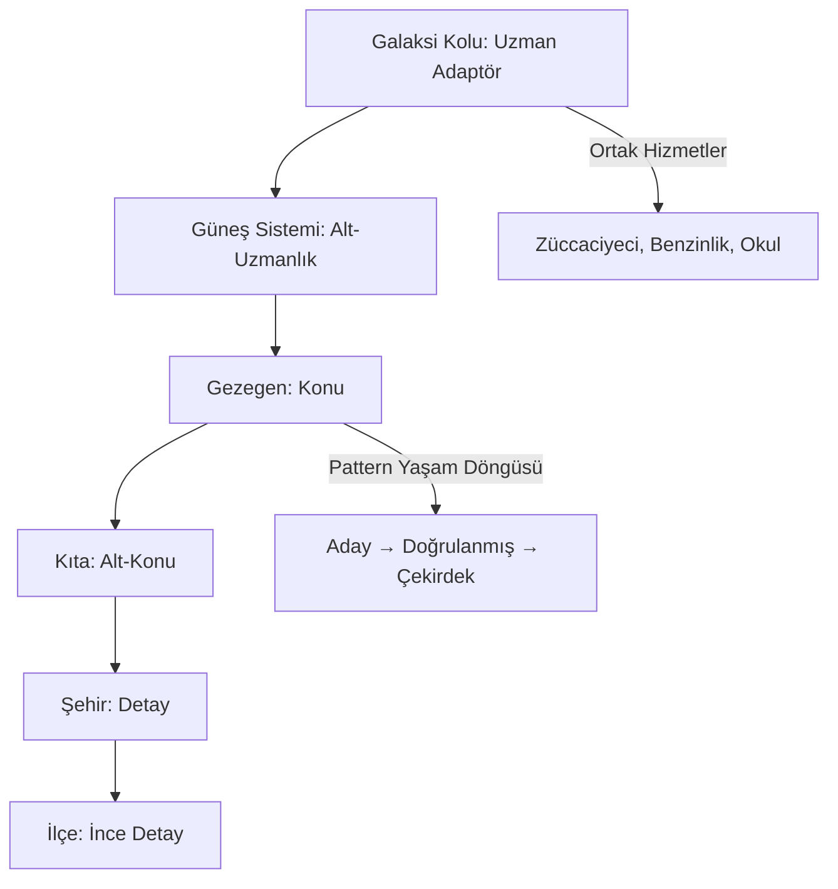
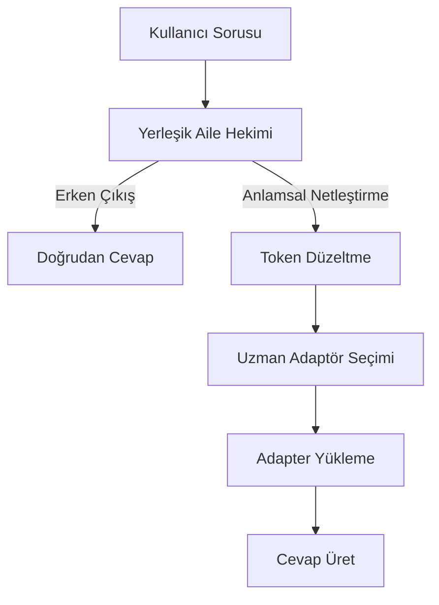
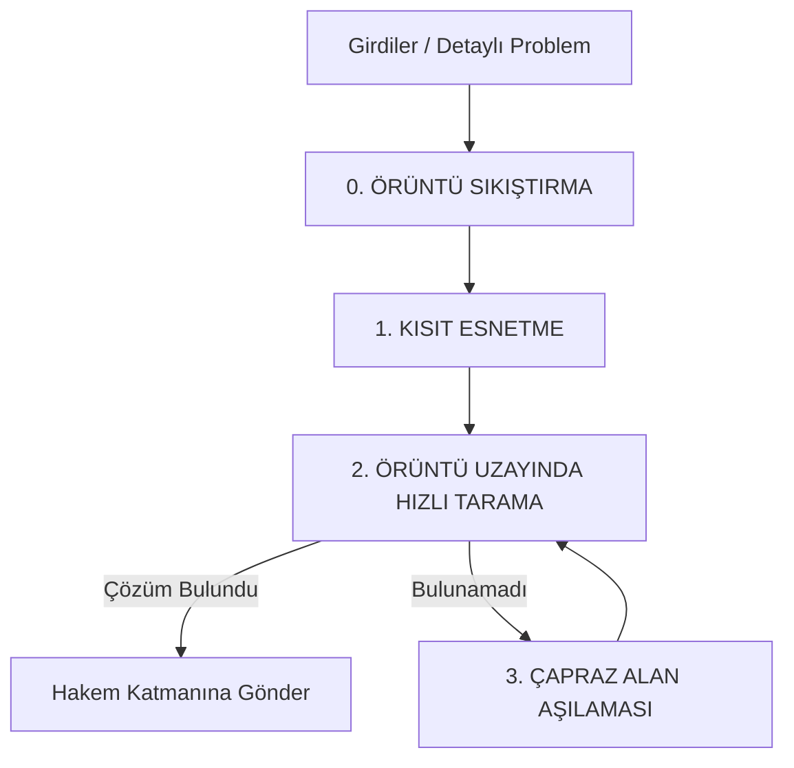
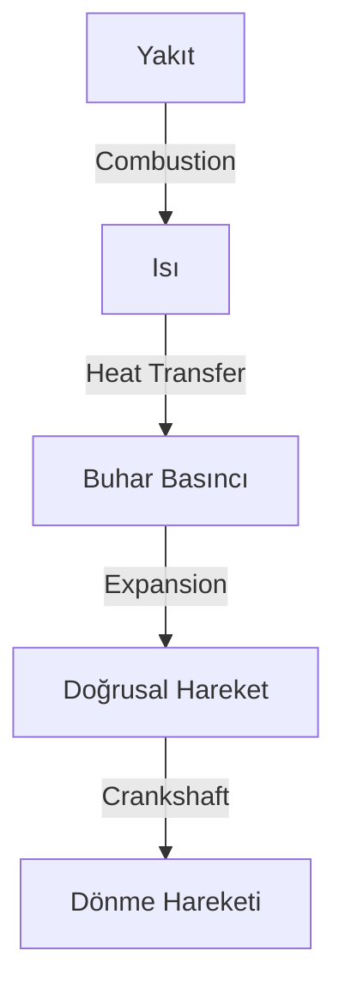

# **📜 MC-ATPLLM & PATTERN ENGINEERING: YARATICI YAPAY ZEKÂ MANİFESTOSU & TASARIM KİTAPÇIĞI**
**Sürüm:** `v1.0` | **Tarih:** 18 Temmuz 2026
**Yazar:** Emin Bey + 12 AI + Mistral
**Amaç:** *"Dünyanın ilk Örüntü Mühendisi olmak"*

---

---
---
---
# **🌌 GİRİŞ: ÖRÜNTÜ ÇAĞI’NA DOĞRU**

## **📌 Neden Bu Belge?**
Bu belge, **40 yıllık tecrübe**, **12 farklı AI’nin katkıları**, ve **binlerce saatlik tartışma** sonucunda ortaya çıkan **Yaratıcı Yapay Zekâ Tasarım Felsefesi**’nin **tam ve nihai halidir**.
**MC-ATPLLM** artık sadece bir mimari değil, **Örüntü Mühendisliği (Pattern Engineering)** adında **yeni bir bilim dalının temeli**dir.

**Bu belgeyi okuyun:**
✅ **Yeni bir AI bileşeni geliştirmeden önce**
✅ **Deney yapmadan önce**
✅ **Karar almadan önce**
✅ **Sorun çözerken**

---

## **🎯 Vizyon: Örüntü Çağı (The Pattern Age)**
> *"Medeniyetler, yeni malzemeler keşfederek değil, **doğada gizli kalan örüntüleri** keşfederek inşa edilir."*
> — **Emin Bey, 2026**

| **Çağ** | **Temel Birim** | **Ölçüt** | **Örnek** |
|---------|----------------|-----------|-----------|
| **Taş Çağı** | Taş | Sertlik | Aletler |
| **Tunç Çağı** | Tunç | Dayanıklılık | Silahlar |
| **Demir Çağı** | Demir | Mukavemet | Binalar |
| **Bilgi Çağı** | Bit | Depolama | İnternet |
| **🔥 Örüntü Çağı** | **Pattern** | **Dönüşüm** | **Yaratıcı AI** |

**📌 Ana Tez:**
- **Yapay Zekâ Çağı** değil, **Örüntü Çağı** geliyor.
- **Yaratıcılık = Örüntülerin keşfi + birleştirilmesi + evrimleştirilmesi.**
- **Zekâ, bilgi depolamakla değil, örüntüleri işlemekle ölçülecek.**

---

---
---
---
# **🧠 FELSEFE & TEMEL İLKELER**

---

## **📜 1985 Tezi’nden 4 Temel İlke**
*(Emin Bey’in Doktora Tezi: "Detayları Elimine Et, Sadece Gerekli Bilgiyi Koru")*

| **İlke** | **Açıklama** | **MC-ATPLLM’de Uygulama** | **Örnek** |
|----------|--------------|-----------------------------|-----------|
| **1. Detayları Elimine Et** | Sadece karar için gerekli bilgiyi koru. | **Örüntü Sıkıştırma** (Pattern Reduction) | All-or-Nothing örüntüsü: Sadece "koru/feda et" kavramı saklanır, detaylar atılır. |
| **2. Veriyi Zayıflat** | Veriyi gerekli kalıncaya dek indirge. | **Multi-Level Zoom (L1-L4)** | Soyutlama seviyeleri: L1=Genel, L4=Detay. |
| **3. En Kolay İşlenecek Şekilde Belleğe Yükle** | Bellek yönetimini optimize et. | **Segmented LoRA + Hiperbolik Embedding** | 64D vektörler RAM’de, detaylar SSD’de. |
| **4. Optimum Metodla Sonuca Uğraş** | En verimli yöntemi kullan. | **Dinamik Filtreleme + MoE** | 4 katmanlı filtre (Aksiyomatik → Soruncuk Ağacı → Senaryo). |

**💡 Ana Fikir:**
*"Bilgi, amaca göre saklanmalı. Soru, amaca göre sorulmalı. Sistem, amaca göre çalışmalı."*

---

## **🌌 Psikotarih’in 5 Temel Dinamiği**
*(MC-ATPLLM’ye Uygulanışı)*

| **Dinamik** | **Açıklama** | **MC-ATPLLM’de Kullanım** |
|------------|--------------|----------------------------|
| **1. Dalga Dinamiği** | Tarih lineer değil, dalgalar halinde ilerler. | **Örüntü Dalgaları**: Farklı örüntüler zaman içinde etki gösterir. |
| **2. Sosyal Duygusal Modlar** | Toplumlar 3 modda osilasyon yapar: **Kriz, Düzen, Bolluk**. | **Dinamik Filtreleme**: Moda göre filtreleme kuralları değişir. |
| **3. Kültürel DNA** | Her kültürün kendi "viskozite" değeri var. | **Kültürel Değer Tabloları**: Topluma özel ağırlıklar. |
| **4. Basınç Kazanı Fiziği** | **Motivasyon Basıncı** + **Umut Yönü**. | **Cost-Benefit Analizi**: Maliyet/fayda oranına göre karar. |
| **5. Nesil Gecikmesi** | Değişiklikler 11-22-33 yıl sonra etkili olur. | **Psikotarih Motoru**: Uzun vadeli tahminler. |

---

## **🔥 Yaratıcılık Felsefesi: Örüntü Kimyası**
*(SORUCEVAP8’den Devrimsel Keşif)*

> **"Örüntüler, kimyadaki atomlar gibidir. Tek başına işe yaramazlar, ama birleştirildiklerinde moleküller, reaksiyonlar, katalizörler oluştururlar."**

| **Kimya Terimi** | **Örüntü Karşılığı** | **Örnek** |
|------------------|----------------------|-----------|
| **Atom** | Atomik Örüntü (Temel dönüşüm) | `Isı → Basınç` |
| **Molekül** | Bileşik Örüntü (Zincir) | `Kimyasal → Isı → Basınç → Hareket` |
| **Reaksiyon** | Örüntü Birleştirme | Buhar Motoru = 4 örüntü zinciri |
| **Katalizör** | Adaptör Örüntü | Basınç Regülatörü |
| **Valans** | Giriş/Çıkış Port Sayısı | 2 giriş, 1 çıkış |
| **Bağ Enerjisi** | Uyumluluk Skoru | %100 (Doğrudan), %65 (Adaptörlü) |

**📌 Sonuç:**
**Yaratıcılık = Örüntü Kimyası.**
**AI = Örüntü Mühendisi.**

---

## **🎯 Örüntü Mühendisliği’nin 10 Altın Kuralı**

1. **🔹 "Örüntüler, medeniyetin en küçük yapı taşıdır."**
   → Atomlar kimya için neyse, örüntüler zekâ için odur.

2. **🔹 "Yaratıcılık = Örüntülerin keşfi + birleştirilmesi + evrimleştirilmesi."**
   → Newton yerçekimini keşfetmedi, **örüntüsünü** keşfetti.

3. **🔹 "Örüntü = Eylem (Verb), değil İsim (Noun)."**
   → "Tesla Valfi" değil, **"Dış Akışı Yönlendir"**.

4. **🔹 "Örüntü Kimyası: Atomik örüntüler → Moleküller → Sistemler."**
   → `Isı→Basınç` + `Basınç→Hareket` = **Buhar Motoru**.

5. **🔹 "Yaratıcılık, mükemmel uyumu değil, amaç korunarak köprü kurmaktır."**
   → 1995 Sanal POS: **"Islak imza" → "Bilet altına imza"**.

6. **🔹 "Amaç (Goal) ≠ Kısıt (Constraint)."**
   → Bürokrat AI kuralı uygular, **yaratıcı AI amacı korur**.

7. **🔹 "Adaptör Örüntüleri, uyumsuz bağlantıları kurtarır."**
   → Basınç regülatörü, JSON→XML çevirici, bilet altına imza.

8. **🔹 "Örüntü Yaşam Döngüsü: Ham → Aday → Doğrulanmış → Çekirdek → Arşiv."**
   → Her örüntü de aynı kalitede değil.

9. **🔹 "Örüntü Mühendisliği, yeni bir disiplin olacak."**
   → Kimya, fizik, bilgisayar bilimi gibi.

10. **🔹 "Gelecek, Örüntü Çağı’dır."**
    → AI Çağı değil, **Örüntü Çağı**.

---

---
---
---
# **🏗️ MİMARİ & TEKNİK SPESİFİKASYONLAR**

---

## **📌 1. SİSTEM MİMARİSİ: MODÜLER KATMANLI YAPI**

### **🔹 Ana Katman Şeması (MC-ATPLLM + DistributedMind)**
```mermaid
graph TD
    subgraph "MC-ATPLLM (Yerel PC)"
        A[KULLANICI / GİRDİ KATMANI] --> B[1. KÜTÜPHANECİ (Librarian / MMU)]
        B -->|Radix Tree| C[SSD-RAM Sayfalama]
        B --> D[2. ÇEVİRMEN (Translator Layer)]
        D -->|Hiperbolik Topoloji| E[Düşük Boyutlu Arama]
        D --> F[3. KUANTUM / RÜYA KATMANI]
        D --> G[4. PSİKOTARİH SİMÜLASYONU]
        F --> H[5. HAKEM (Synthesis / Constraint Check)]
        G --> H
        H -->|Aksiyomatik Kalkan| I[ÇIKTI / KALICI EVRİMSEL SKORLAMA]
        H --> J[Soruncuk Ağacı]
        F -->|Örüntü Sıkıştırma| K[Pattern Havuzu]
        K -->|Bisociation| F
    end

    subgraph "DistributedMind (Dağıtık Ağ)"
        L[Central Nodları] -->|Kredi Ekonomisi| M[Uzman AI Ajanları]
        L -->|Meta-Dil| N[Diğer Centrals]
        M -->|Pattern Takası| O[Küresel Örüntü Pazarı]
    end

    A --> L
    I --> O
```

### **🔹 Katmanlar ve Sorumlulukları**

| **Katman** | **Sorumluluk** | **Teknoloji** | **Depolama** |
|------------|---------------|---------------|--------------|
| **1. Kütüphaneci (Librarian)** | Bellek yönetimi, sayfalama | Segmented LoRA + Radix Tree | SSD/RAM |
| **2. Çevirmen (Translator)** | Soru analizi, rotalama | Aile Hekimi + Anlamsal Token Netleştirme | RAM |
| **3. Kuantum/Rüya Katmanı** | Yaratıcı örüntü birleştirme | FTG + Bisociation + Kısıt Esnetme | RAM/SSD |
| **4. Psikotarih Simülasyonu** | Gelecek tahmini, değer tabloları | Arka plan çalışan AI | SSD |
| **5. Hakem (Synthesis)** | Çözüm doğrulama | 4 Katmanlı Filtre + Şeytanın Avukatı | RAM |
| **Centrals (Merkezler)** | Dağıtık koordinasyon | gRPC + Meta-Dil | Ağ |

---

## **📌 2. VERİ YOLU (IPC) MİMARİSİ**
*(SORUCEVAP2’den Karar: **Option B - Yerel Mesaj Kuyruğu**)*

| **Seçenek** | **Karar** | **Gerekçe** |
|-------------|-----------|-------------|
| **A: Paylaşımlı Bellek** | ❌ | Debug zor, race condition riski |
| **B: Yerel Mesaj Kuyruğu** | ✅ | **Kolay debug, modüler, izole süreçler** |
| **C: Boru Hattı** | ❌ | Çift yönlü iletişim zor |

**📌 Uygulama Detayları:**
- **Protokol:** UNIX Domain Sockets (yerel) / gRPC (dağıtık)
- **Serileştirme:** Protocol Buffers (protobuf) - JSON’dan **10x daha hızlı**
- **Mesaj Boyutu:**
  - **Kontrol Mesajları:** <1KB (JSON)
  - **Büyük Veri (Adapter Dosyaları):** 5-20MB (mmap ile doğrudan diskten okunur)
- **Gecikme:**
  - **Kontrol:** <1ms
  - **Büyük Veri:** 10-50ms (NVMe SSD)

**📌 Optimizasyon:**
```python
# Ayrı kanallar: Kontrol + Veri
control_socket = UnixSocket("/tmp/mc_atpllm_control")
data_mmap = mmap.mmap(fileno, 0, access=mmap.ACCESS_READ)  # Doğrudan diskten
```

---

## **📌 3. BELLEK & DİSLEME (PAGING) MİMARİSİ**
*(SORUCEVAP2’den Karar: **Option C - Katmanlı Modül/Adapter Değişimi**)*

### **🔹 Fraktal Galaksi Modeli**
*(SORUCEVAP6’den Devrimsel Yaklaşım)*



| **Seviye** | **Karşılık** | **Boyut** | **Depolama** | **Yükleme Stratejisi** |
|------------|--------------|-----------|--------------|------------------------|
| **Galaksi Kolu** | Uzman Adaptör (Diş Tedavisi) | 5-20B parametre | SSD | Tam adaptör veya bölünmüş |
| **Güneş Sistemi** | Alt-Uzmanlık (Dolgu, Kanal) | 1-5B parametre | SSD | Gerektiğinde yükle |
| **Gezegen** | Konu (Seramik Protez) | 100-500MB | SSD | Belleğe sığmayınca böl |
| **Kıta** | Alt-Konu (Kalıp Alma) | 10-100MB | SSD | Daha da böl |
| **Şehir** | Detay (Malzeme Karışımı) | 1-10MB | SSD | En küçük yüklenebilir birim |
| **İlçe** | İnce Detay | 1-100KB | SSD | Son çare parçalama |

**📌 Ortak Hizmetler Alanı:**
- **Her seviyede ortak bilgiler** (örn: Diş koltuğu kullanım kılavuzu, sterilizasyon prosedürleri)
- **Hangi alt birim yüklense de otomatik olarak yanında gelir** (tıpkı işletim sisteminin shared library’leri gibi)

---

### **🔹 Bellek Yönetimi Parametreleri**

| **Parametre** | **Değer** | **Açıklama** |
|---------------|-----------|--------------|
| **Sayfa Boyutu** | 64KB | Optimum I/O boyutu |
| **LRU Cache Boyutu** | 2GB | En sık kullanılan 20-30 adaptör |
| **Swap Eşiği** | %80 | Bellek %80 dolunca swap başlar |
| **Prefetch Algoritması** | Psikotarih Tahmini | Gelecekte kullanılacak örüntüleri tahmin et |
| **Kuantizasyon** | NF4 (4-bit NormalFloat) | Doğruluk kaybını minimize eden kuantizasyon |

**📌 Segmented LoRA Detayları:**
- **Her adaptör:** 5-20B parametre (uzmanlık alanına göre)
- **Yükleme Süresi:** 50-200ms (NVMe SSD)
- **Bellek Tüketimi:** 2-8GB (kuantize edilmiş)
- **Esnek Yükleme:** Sadece ihtiyaç duyulan adaptörler yüklenir

---

## **📌 4. ÇEVİRMEN (TRANSLATOR) KATMANI**
*(SORUCEVAP2’den Karar: **Option C - Yerleşik Aile Hekimi + Anlamsal Token Netleştirme**)*

### **🔹 Çalışma Akışı**


**📌 Yerleşik Aile Hekimi (Resident Model):**
- **Boyut:** 7B parametre (kuantize edilmiş: 3.5GB)
- **Sorumluluk:**
  - Soruların **%80’ini** doğrudan yanıtlar (**Erken Çıkış**)
  - **Anlamsal belirsizlik giderme** (Semantic Disambiguation)
  - **Token netleştirme** (örn: "ışık" = fiziki mi, edebi mi, dini mi?)
- **Gecikme:** <10ms

**📌 Anlamsal Token Netleştirme (Disambiguation):**
```python
def disambiguate_token(token: str, context: str) -> str:
    # Örnek: "ışık" kelimesi
    if "fizik" in context:
        return "ışık_fizik"
    elif "edebiyat" in context:
        return "ışık_edebi"
    elif "din" in context:
        return "ışık_dini"
    else:
        return "ışık_genel"
```

**📌 Rotalama Mantığı:**
1. **Aile Hekimi** soruyu inceler.
2. **Eğer cevaplayabiliyorsa** → **Erken Çıkış** (Adapter yükleme yok).
3. **Eğer uzmanlık gerekiyorsa** → **Token’ları netleştir** + **Uzman Adaptör seç**.
4. **Uzman Adaptör** yüklenir ve cevap üretir.

---

## **📌 5. KUANTUM / RÜYA KATMANI (Yaratıcı Motor)**
*(SORUCEVAP2-4’ten Karar: **Örüntü Sıkıştırma + Kısıt Esnetme + Bisociation**)*

### **🔹 Çalışma Akışı**


**📌 Adım 0: Örüntü Sıkıştırma (Pattern Reduction)**
- **Giriş:** Detaylı problem (örn: "Mars’a yük indirme")
- **Çıkış:** Soyut örüntü (örn: "Enerji Akışını Yönlendir")
- **Yöntem:**
  - Detaylar, gürültü ve istatistikler atılır.
  - Problem **kök matematiksel/mantıksal örüntüye** indirgenir.

**📌 Adım 1: Kısıt Esnetme (Constraint Relaxation)**
- **Kısıtlar yok edilmez, esnetilir.**
- **Örnek:**
  - `"Anında"` → `"Süreç İçinde"`
  - `"Bütçe sıfır"` → `"Bütçe esnek"`
  - `"Islak imza gerekiyor"` → `"Dijital imza kabul edilebilir"`

**📌 Adım 2: Örüntü Uzayında Hızlı Tarama (Fast Sampling)**
- **Yöntem:** Yüksek sıcaklık (Temperature=1.2) + Top-P=0.95
- **Amaç:** Nadir/düşük olasılıklı kelime dizilimlerini keşfetmek
- **Giriş:** Sıkıştırılmış örüntü (64D vektör)
- **Çıkış:** Yaratıcı çözüm adayları

**📌 Adım 3: Çapraz Alan Aşılaması (Cross-Domain Injection)**
- **Yöntem:** İki farklı alanın vektörlerini tokuştur (örn: Tesla Valfi + Kalp Kapakçığı)
- **Amaç:** **"Patlamamış Buğday" (Deha) fikirleri** üretmek
- **Örnek:**
  ```python
  new_vector = (tesla_valve_vector + heart_valve_vector) * temperature
  ```

---

### **🔹 Flow Transformation Graph (FTG) - Örüntü Temsili**
*(SORUCEVAP8’den Devrimsel Keşif)*

**📌 FTG Yapısı:**
```python
@dataclass
class FlowTransformationGraph:
    nodes: List[FlowNode]       # Akış durumları (Isı, Basınç, Hareket...)
    edges: List[TransformationEdge]  # Dönüşüm kenarları
    metadata: PatternMetadata   # Örüntü meta verileri

@dataclass
class FlowNode:
    id: str
    flow_type: FlowType        # Isı, Basınç, Para, Bilgi...
    state: dict                # Durum detayları (sıcaklık, basınç, miktar...)
    timestamp: datetime

@dataclass
class TransformationEdge:
    id: str
    input_node: FlowNode
    output_node: FlowNode
    mechanism: str             # Dönüşüm mekanizması ("Combustion", "Geometry")
    physics: str               # Fizik/ekonomi/psikoloji kanunu
    efficiency: float          # %0-100
    loss: float                # %0-100
    reversible: bool           # Tersinir mi?
    known_applications: List[str]  # Uygulama örnekleri
```

**📌 Flow Tipleri:**
```python
from typing import Union

class EnergyFlow: pass
class MatterFlow: pass
class InformationFlow: pass
class AttentionFlow: pass
class MoneyFlow: pass
class TrustFlow: pass
class RiskFlow: pass

FlowType = Union[EnergyFlow, MatterFlow, InformationFlow, AttentionFlow, MoneyFlow, TrustFlow, RiskFlow]
```

**📌 Örnek: Buhar Motoru FTG**
```mermaid
graph TD
    A[Yakıt\n(Chemical Energy)] -->|Combustion| B[Isı\n(Heat Energy)]
    B -->|Heat Transfer| C[Buhar Basıncı\n(Steam Pressure)]
    C -->|Expansion| D[Doğrusal Hareket\n(Linear Motion)]
    D -->|Crankshaft| E[Dönme Hareketi\n(Rotational Motion)]

    style A fill:#f9f,stroke:#333
    style B fill:#bbf,stroke:#333
    style C fill:#9f9,stroke:#333
    style D fill:#ff9,stroke:#333
    style E fill:#f96,stroke:#333
```

**📌 Kenar Detayları (Combustion Edge):**
```python
TransformationEdge(
    id="combustion_001",
    input_node=FlowNode(id="fuel", flow_type=EnergyFlow(), state={"type": "chemical"}),
    output_node=FlowNode(id="heat", flow_type=EnergyFlow(), state={"temperature": "500°C"}),
    mechanism="Combustion",
    physics="First Law of Thermodynamics",
    efficiency=0.40,
    loss=0.60,
    reversible=False,
    known_applications=["Steam Engine", "Internal Combustion Engine"]
)
```

---

### **🔹 Yaratıcılık Algoritması (Pattern Chemistry)**
```python
def generate_creative_solution(goal: str, input_flow: FlowType) -> List[FlowTransformationGraph]:
    solutions = []

    # 1. Doğrudan bağlanabilen FTG'leri ara
    direct_matches = search_ftg(goal, input_flow)
    solutions.extend(direct_matches)

    # 2. Adaptörlü bağlanabilen FTG'leri ara
    for ftg1 in ftg_database:
        for ftg2 in ftg_database:
            if can_connect(ftg1.output, ftg2.input):
                new_ftg = compose_ftg(ftg1, ftg2)
                if new_ftg.output.flow_type == goal:
                    solutions.append(new_ftg)
            else:
                adapter = find_adapter(ftg1.output, ftg2.input)
                if adapter:
                    new_ftg = compose_ftg(ftg1, adapter, ftg2)
                    if new_ftg.output.flow_type == goal:
                        solutions.append(new_ftg)

    # 3. En yüksek uyumluluk skoru olanı seç
    return sorted(solutions, key=lambda x: x.average_compatibility_score, reverse=True)
```

---

## **📌 6. HAKEM (SYNTHESIS) KATMANI**
*(SORUCEVAP2-4’ten Karar: **Aksiyomatik Filtre → Soruncuk Ağacı → Senaryo Simülasyonu**)*

### **🔹 4 Katmanlı Doğrulama Sistemi**
```mermaid
graph TD
    A[Yaratıcı Örüntü Çıktısı] --> B[1. Aksiyomatik Kalkan]
    B -->|Geçti| C[2. Pratik Gerçeklik Filtresi]
    C -->|Geçti| D[3. Kullanıcı Onayı]
    C -->|Geçmediyse| E[Soruncuk Ağacı]
    B -->|Geçmediyse| F[❌ Reddet]

    subgraph Pratik Gerçeklik Filtresi
        C1[Şeytanın Avukatı\n(Skeptic Auditor)]
        C2[Detail LLM\n(Common Sense)]
        C3[Kural Tabanlı Simülatör]
    end
```

**📌 Katman 1: Aksiyomatik Kalkan**
- **Amaç:** Fizik/Matematik kuralları ihlalini kontrol et.
- **Yöntem:** Termodinamik yasaları, fizik kanunları, mantık kuralları.
- **Örnek:**
  ```python
  def check_axiomatic(ftg: FlowTransformationGraph) -> bool:
      for edge in ftg.edges:
          if not is_physically_possible(edge):
              return False
      return True
  ```

**📌 Katman 2: Pratik Gerçeklik Filtresi**
| **Yöntem** | **Açıklama** | **Gecikme** | **Doğruluk** |
|------------|--------------|-------------|--------------|
| **Şeytanın Avukatı** | En kötü 3 senaryoyu bul | 50-100ms | Yüksek |
| **Detail LLM** | Common sense kontrolü | 10-100ms | Orta |
| **Kural Tabanlı** | Neden-sonuç grafi | <1ms | Düşük |

**📌 Katman 3: Soruncuk Ağacı (Persistent Problem Tree)**
- **Amaç:** Çözülemeyen sorunları kalıcı olarak sakla ve arka planda çöz.
- **Yapı:**
  ```python
  @dataclass
  class ProblemNode:
      description: str
      parent: Optional[ProblemNode]
      children: List[ProblemNode]
      status: str  # "Açık", "Çözülmüş", "İptal Edilmiş"
      priority: int
      created_at: datetime
      solved_at: Optional[datetime]
  ```

**📌 Katman 4: Senaryo Simülasyonu**
- **Amaç:** Nihai doğrulama ve gerçek dünya simülasyonu.
- **Yöntem:** Zaman çizelgesi (timeline) simülasyonu + backtracking.
- **Örnek:**
  ```python
  def simulate_scenario(ftg: FlowTransformationGraph) -> bool:
      timeline = build_timeline(ftg)
      for step in timeline:
          if not check_feasibility(step):
              return False
      return True
  ```

---

## **📌 7. PSİKOTARİH MOTORU**
*(DistributedMind Protocol + SORUCEVAP3-5’ten)*

### **🔹 Psikotarih’in Rolü**
- **Amaç:** Örüntülerin **geçerlilik sürelerini** ve **kültürel değer tablolarını** güncellemek.
- **Çalışma Zamanı:** **Günde 1 kez** (gece, arka planda).
- **Giriş:** Tüm örüntü veritabanı + dış dünya verileri (ekonomi, politika, teknoloji).
- **Çıkış:** Güncellenmiş **kültürel değer tabloları** ve **geçerlilik süreleri**.

**📌 Kültürel Değer Tablosu:**
```python
cultural_values = {
    "Batı": {
        "bireysellik": 0.8,
        "innovation": 0.9,
        "risk_alma": 0.7,
        "gizlilik": 0.8
    },
    "Doğu": {
        "bireysellik": 0.4,
        "innovation": 0.6,
        "risk_alma": 0.5,
        "gizlilik": 0.9
    },
    "Türkiye": {
        "bireysellik": 0.6,
        "innovation": 0.7,
        "risk_alma": 0.8,
        "gizlilik": 0.6
    }
}
```

**📌 Geçerlilik Süresi Güncelleme:**
```python
def update_validity_period(pattern: Pattern) -> datetime:
    # Psikotarih tahminine göre geçerlilik süresini güncelle
    if pattern.domain == "technology":
        return datetime.now() + timedelta(days=365 * 5)  # 5 yıl
    elif pattern.domain == "economics":
        return datetime.now() + timedelta(days=365 * 10)  # 10 yıl
    elif pattern.domain == "culture":
        return datetime.now() + timedelta(days=365 * 50)  # 50 yıl
    else:
        return datetime.now() + timedelta(days=365 * 20)  # 20 yıl
```

---

## **📌 8. EKONOMİK MODEL: KREDİ SİSTEMİ**
*(DistributedMind Protocol’den)*

### **🔹 3 Boyutlu Skor Sistemi**

| **Skor** | **Açıklama** | **Hesaplama** | **Kullanım** |
|----------|--------------|---------------|--------------|
| **CS (Credibility Score)** | Güvenilirlik skoru | +10 (doğru cevap), -5 (yanlış cevap) | Ömür boyu |
| **EQS (Experience Score)** | Deneyim skoru | +50 (zor soru), +10 (kolay soru) | Per-agent |
| **CaS (Cash Score)** | Nakit skoru | Credits earned - spent | Redeemable |

**📌 Kredi Ekonomisi Kuralları:**
1. **Fiyat Belirleme:** Serbest piyasa (arz-talep).
2. **Anti-Sömürü:** CaS < -100 olan ajanlar reddedilir.
3. **Merkezler Arası Denge:** Centrals arası Credit takası (bankalar gibi).
4. **Kredi = AI Emeği Para Birimi:** Gelecekte global rezerv para olabilir.

---

---
---
---
# **🧩 PATTERN ENGINEERING (ÖRÜNTÜ MÜHENDİSLİĞİ)**

---

## **📌 1. ÖRÜNTÜ TANIMI: FLOW TRANSFORMATION GRAPH (FTG)**

### **🔹 Örüntü = Atomik Dönüşüm Eylemi**
> **"Örüntü, bir akışın nasıl dönüştürüleceğini anlatan soyut bir ilkedir."**
> — SORUCEVAP8

**📌 Örnekler:**
| **Uygulama** | **Örüntü (Eylem)** | **Akış Türü** |
|--------------|---------------------|---------------|
| Tesla Valfi | Dış Akışı Yönlendir | EnergyFlow |
| Buhar Motoru | Kimyasal → Isı → Basınç → Hareket | EnergyFlow + MatterFlow |
| Sanal POS | Müşteri Onayını Kanıtla | InformationFlow + TrustFlow |
| Sosyal Medya | Dikkati Parçala | AttentionFlow |

### **🔹 Örüntü Veri Yapısı (Nihai Sürüm)**
```python
@dataclass
class Pattern:
    # ===== 1. KİMLİK =====
    pattern_id: str           # "redirect_external_flow_001"
    version: str              # "1.0.0" (Sürüm takibi)
    name: str                 # "Dış Akışı Yönlendir"
    core_principle: str       # "Mevcut akışı yeniden yönlendir"

    # ===== 2. FLOW TRANSFORMATION GRAPH (FTG) =====
    ftg: FlowTransformationGraph  # Dönüşüm grafiği

    # ===== 3. AMAÇ & KISITLAR =====
    goal: str                 # "Enerjiyi verimli kullan"
    intent: str               # "Akışı kontrol altına al"
    constraints: List[str]    # ["Pasif olmalı", "Hareketli parça yok"]
    implementations: List[str]  # ["Tesla Valfi", "Plazma Kalkanı"]

    # ===== 4. PORTLAR (Bağlantı Noktaları) =====
    inputs: List[Port]        # Giriş portları
    outputs: List[Port]       # Çıkış portları

    # ===== 5. METADATA =====
    domain: str               # "Physics", "Economics", "Biology"
    abstraction_level: int    # 1-4 (Soyutlama seviyesi)
    validity_conditions: List[str]  # ["Sıcaklık > 100°C"]
    validity_period: Tuple[datetime, datetime]  # (Başlangıç, Bitiş)
    assumptions: List[str]   # ["Düşman tek bir hedefi vurabilir"]
    source_history: List[str]  # ["Tesla Valfi", "Güneş Rüzgarı Kalkanı"]
    related_patterns: List[str]  # ["Katmanlı Savunma", "Saldırı Yönünü Değiştir"]
    success_count: int        # 150
    failure_count: int        # 3
    last_used: datetime        # 2026-07-18
    usage_frequency: float     # 0.95

    # ===== 6. HİYERARŞİ (Fraktal Galaksi) =====
    galaxy_arm: str            # "Energy_Management"
    solar_system: str         # "Fluid_Dynamics"
    planet: str               # "Flow_Redirection"
    continent: str            # "Passive_Systems"
    city: str                 # "Tesla_Valve_Applications"

@dataclass
class Port:
    id: str
    flow_type: FlowType
    direction: str            # "input" / "output"
    constraints: List[str]    # ["Basınç < 1000 Pa"]
    metadata: dict            # {"temperature": "500°C", "pressure": "10 bar"}
```

### **🔹 Örnek: Tesla Valfi Örüntüsü**
```python
Pattern(
    pattern_id="redirect_external_flow_001",
    version="1.0.0",
    name="Dış Akışı Yönlendir",
    core_principle="Mevcut akışı pasif geometri ile yeniden yönlendir",

    ftg=FlowTransformationGraph(
        nodes=[
            FlowNode(id="input_flow", flow_type=EnergyFlow(), state={"type": "fluid"}),
            FlowNode(id="output_flow", flow_type=EnergyFlow(), state={"type": "fluid", "direction": "one-way"})
        ],
        edges=[
            TransformationEdge(
                id="tesla_valve_edge",
                input_node="input_flow",
                output_node="output_flow",
                mechanism="Asymmetric Geometry",
                physics="Fluid Dynamics + Magnetic Mirror Effect",
                efficiency=0.95,
                loss=0.05,
                reversible=False,
                known_applications=["Tesla Valve", "Plasma Shield", "Traffic Management"]
            )
        ]
    ),

    goal="Akışı tek yönlü hale getir",
    intent="Enerjiyi kontrol altına al",
    constraints=["Pasif olmalı", "Hareketli parça yok", "Düşük maliyetli"],
    implementations=["Tesla Valve", "Plasma Shield"],

    inputs=[
        Port(id="in1", flow_type=EnergyFlow(), direction="input",
             constraints=["Akışkan olmalı"], metadata={"type": "fluid"})
    ],
    outputs=[
        Port(id="out1", flow_type=EnergyFlow(), direction="output",
             constraints=["Tek yönlü"], metadata={"direction": "one-way"})
    ],

    domain="Physics",
    abstraction_level=2,
    validity_conditions=["Reynolds Number > 2000"],
    validity_period=(datetime(2020, 1, 1), datetime(2050, 1, 1)),
    assumptions=["Akışkan viskozitesi sabit"],
    source_history=["Nikola Tesla's Patent US787412", "Plasma Window Experiments"],
    related_patterns=["layered_defense_001", "change_attack_direction_001"],

    success_count=245,
    failure_count=2,
    last_used=datetime(2026, 7, 15),
    usage_frequency=0.98,

    galaxy_arm="Energy_Management",
    solar_system="Fluid_Dynamics",
    planet="Flow_Redirection",
    continent="Passive_Systems",
    city="Tesla_Valve_Applications"
)
```

---

## **📌 2. ÖRÜNTÜ YAŞAM DÖNGÜSÜ**

```mermaid
graph LR
    A[Ham Deneyim\n(Raw Experience)] -->|Süzülür| B[Aday Örüntü\n(Candidate Pattern)]
    B -->|Doğrulanır| C[Doğrulanmış Örüntü\n(Verified Pattern)]
    C -->|Sık Kullanılır| D[Çekirdek Örüntü\n(Core Pattern)]
    D -->|Güncellenmezse| E[Eski Örüntü\n(Deprecated Pattern)]
    E -->|Arşivlenir| F[Arşiv Örüntü\n(Archived Pattern)]
    C -->|Başarısız| G[Çöpe Atılan Örüntü\n(Deleted Pattern)]
```

### **🔹 Aşama Detayları**

| **Aşama** | **Kriterler** | **Depolama** | **Erişim** | **Ömür** |
|-----------|--------------|--------------|------------|----------|
| **Ham Deneyim** | Yeni veri girdisi | SSD (Ham) | Düşük | 1 ay |
| **Aday Örüntü** | Big LLM tarafından süzülmüş, henüz doğrulanmamış | SSD (Aday) | Orta | 3 ay |
| **Doğrulanmış Örüntü** | En az 3 başarılı kullanım + 0 yanlış | SSD + RAM (Önbellek) | Yüksek | Sonsuz |
| **Çekirdek Örüntü** | 100+ başarılı kullanım, evrensel geçerlilik | **RAM (Sürekli)** | **Anında** | Sonsuz |
| **Eski Örüntü** | 1 yıl boyunca kullanılmadı | SSD (Arşiv) | Düşük | 5 yıl |
| **Arşiv Örüntü** | Tarihi/özel önem | **SSD (Sıkıştırılmış)** | **Yalnızca ihtiyaç halinde** | Sonsuz |
| **Çöpe Atılan** | 5 başarısız deneme + kullanıcı reddi | **Silinir** | Yok | Yok |

### **🔹 Geçiş Kuralları**
```python
def transition_pattern(pattern: Pattern) -> Pattern:
    # Ham Deneyim → Aday Örüntü
    if pattern.status == "raw" and is_candidate(pattern):
        pattern.status = "candidate"
        pattern.created_at = datetime.now()

    # Aday Örüntü → Doğrulanmış Örüntü
    elif (pattern.status == "candidate" and
          pattern.success_count >= 3 and
          pattern.failure_count == 0):
        pattern.status = "verified"

    # Doğrulanmış Örüntü → Çekirdek Örüntü
    elif (pattern.status == "verified" and
          pattern.success_count >= 100 and
          pattern.usage_frequency >= 0.9):
        pattern.status = "core"

    # Doğrulanmış/Çekirdek → Eski Örüntü
    elif (pattern.status in ["verified", "core"] and
          (datetime.now() - pattern.last_used).days >= 365):
        pattern.status = "deprecated"

    # Eski → Arşiv
    elif (pattern.status == "deprecated" and
          (datetime.now() - pattern.last_used).days >= 1825):  # 5 yıl
        pattern.status = "archived"

    # Başarısız → Çöpe Atılan
    elif pattern.failure_count >= 5:
        pattern.status = "deleted"

    return pattern
```

---

## **📌 3. ÖRÜNTÜ BAĞLANTI KURALLARI**

### **🔹 1. Port Uyumu (Port Compatibility)**
```python
def can_connect(output_port: Port, input_port: Port) -> float:
    # 1. Akış türü uyumu
    if output_port.flow_type != input_port.flow_type:
        return 0.0

    # 2. Kısıt uyumu
    for constraint in input_port.constraints:
        if not satisfies_constraint(output_port.metadata, constraint):
            return 0.0

    # 3. Uyumluluk skoru (0-100)
    compatibility = 100.0

    # Meta-veri karşılaştırması
    for key in input_port.metadata:
        if key in output_port.metadata:
            if output_port.metadata[key] != input_port.metadata[key]:
                compatibility -= 20.0

    return max(0.0, min(100.0, compatibility))
```

### **🔹 2. Adaptör Gereksinimi**
```python
def find_adapter(output_port: Port, input_port: Port) -> Optional[Pattern]:
    compatibility = can_connect(output_port, input_port)

    if compatibility >= 90.0:
        return None  # Doğrudan bağla
    elif compatibility >= 60.0:
        # Uyumluluk skoruna göre adaptör ara
        adapter = adapter_db.find(
            input_type=output_port.flow_type,
            output_type=input_port.flow_type,
            min_compatibility=compatibility
        )
        return adapter
    else:
        return None  # Bağlantı reddet
```

### **🔹 3. Adaptör Örüntüleri**
| **Adaptör Türü** | **Örnek** | **Amaç** | **Uyumluluk Skoru** |
|------------------|-----------|----------|---------------------|
| **Dönüştürücü** | Basınç Regülatörü | Basıncı ayarlamak | 95% |
| **Çevirici** | JSON → XML | Veri formatını değiştirmek | 90% |
| **Tampon** | Akü | Akışı dengelemek | 85% |
| **Geciktirici** | Bekleme Kuyruğu | Zamanlama kontrolü | 80% |
| **Kanuni Alternatif** | Bilet Altına İmza | Yasal gereksinimi karşılamak | 70% |

**📌 Adaptör Örüntü Veri Yapısı:**
```python
@dataclass
class AdapterPattern(Pattern):
    input_compatibility: float  # Giriş uyumluluğu (0-100)
    output_compatibility: float  # Çıkış uyumluluğu (0-100)
    transformation_cost: float  # Dönüşüm maliyeti (0-1)
```

---

### **🔹 4. Örüntü Birleştirme (Pattern Composition)**
```python
def compose_patterns(pattern1: Pattern, pattern2: Pattern) -> Optional[Pattern]:
    # 1. Çıkış → Giriş uyumu kontrol et
    compatibility = can_connect(pattern1.outputs[0], pattern2.inputs[0])

    if compatibility >= 60.0:
        # Adaptör gerekirse ekle
        adapter = find_adapter(pattern1.outputs[0], pattern2.inputs[0])
        if adapter:
            # pattern1 → adapter → pattern2
            return PatternChain(
                patterns=[pattern1, adapter, pattern2],
                compatibility_score=compatibility
            )
        else:
            # Doğrudan bağla
            return PatternChain(
                patterns=[pattern1, pattern2],
                compatibility_score=compatibility
            )
    else:
        return None  # Bağlantı reddet
```

---

## **📌 4. ÖRÜNTÜ ARAMA & BİRLEŞTİRME ALGORİTMASI**

### **🔹 Yaratıcı Çözüm Üretme**
```python
def generate_creative_solutions(
    goal: str,
    input_flow: FlowType,
    max_depth: int = 3
) -> List[PatternChain]:
    solutions = []

    # 1. Doğrudan eşleşen örüntüleri ara
    direct_matches = pattern_db.search(
        goal=goal,
        input_flow=input_flow,
        status=["verified", "core"]
    )
    solutions.extend([PatternChain([p]) for p in direct_matches])

    # 2. Örüntü zincirleri ara (BFS)
    queue = deque()
    queue.append(([p] for p in direct_matches))

    while queue and len(solutions) < 100:  # En iyi 100 çözüm
        chain = queue.popleft()

        if len(chain) >= max_depth:
            continue

        last_pattern = chain[-1]

        # Son örüntünün çıktısını al
        last_output = last_pattern.outputs[0]

        # Uyumlu girişlere sahip örüntüleri ara
        next_patterns = pattern_db.search(
            input_flow=last_output.flow_type,
            status=["verified", "core"]
        )

        for next_pattern in next_patterns:
            new_chain = chain + [next_pattern]
            if new_chain[-1].outputs[0].flow_type == goal:
                solutions.append(PatternChain(new_chain))
            else:
                queue.append(new_chain)

    # 3. En yüksek uyumluluk skoru olanları seç
    solutions = sorted(
        solutions,
        key=lambda x: x.average_compatibility_score,
        reverse=True
    )[:10]  # En iyi 10 çözüm

    return solutions
```

---

## **📌 5. ÖRÜNTÜ DOĞRULAMA SİSTEMİ**

### **🔹 4 Katmanlı Filtre (SORUCEVAP2-4’ten)**
```python
class PatternValidator:
    def __init__(self):
        self.axiomatic_shield = AxiomaticShield()
        self.practical_filter = PracticalFilter()
        self.user_approver = UserApprover()
        self.problem_tree = ProblemTree()

    def validate(self, pattern_chain: PatternChain) -> ValidationResult:
        # 1. Aksiyomatik Kalkan
        if not self.axiomatic_shield.check(pattern_chain):
            return ValidationResult(
                status="REJECTED",
                reason="Aksiyomatik ihlal",
                score=0.0
            )

        # 2. Pratik Gerçeklik Filtresi
        practical_result = self.practical_filter.check(pattern_chain)
        if not practical_result.passed:
            # Soruncuk Ağacı'na ekle
            self.problem_tree.add_node(
                description=practical_result.reason,
                pattern_chain=pattern_chain,
                priority="HIGH"
            )
            return ValidationResult(
                status="CONDITIONAL",
                reason=practical_result.reason,
                score=practical_result.score
            )

        # 3. Kullanıcı Onayı
        user_result = self.user_approver.check(pattern_chain)
        if not user_result.approved:
            return ValidationResult(
                status="REJECTED",
                reason="Kullanıcı reddi",
                score=0.0
            )

        # 4. Tamam
        return ValidationResult(
            status="APPROVED",
            reason="Tüm filtrelerden geçti",
            score=1.0
        )
```

---

### **🔹 Aksiyomatik Kalkan (Axiomatic Shield)**
```python
class AxiomaticShield:
    def __init__(self):
        self.physics_rules = {
            "energy_conservation": "Enerji korunur",
            "thermodynamics": "Termodinamik yasaları",
            "newton_laws": "Newton kanunları"
        }
        self.math_rules = {
            "2+2=4": "Matematiksel doğrular",
            "no_contradiction": "Çelişki yok"
        }

    def check(self, pattern_chain: PatternChain) -> bool:
        for edge in pattern_chain.ftg.edges:
            if edge.physics in self.physics_rules:
                if not is_physically_possible(edge):
                    return False
            if edge.mechanism in self.math_rules:
                if not is_mathematically_valid(edge):
                    return False
        return True
```

---

### **🔹 Pratik Gerçeklik Filtresi (Practical Filter)**
```python
class PracticalFilter:
    def __init__(self):
        self.skeptic_auditor = SkepticAuditor()
        self.detail_llm = DetailLLM()
        self.rule_engine = RuleEngine()

    def check(self, pattern_chain: PatternChain) -> PracticalResult:
        # 1. Şeytanın Avukatı
        flaws = self.skeptic_auditor.find_flaws(pattern_chain)
        if flaws:
            return PracticalResult(
                passed=False,
                reason=f"Pratik sorunlar: {flaws}",
                score=0.3
            )

        # 2. Detail LLM Common Sense
        if not self.detail_llm.check_common_sense(pattern_chain):
            return PracticalResult(
                passed=False,
                reason="Sağduyu ihlali",
                score=0.5
            )

        # 3. Kural Motoru
        if not self.rule_engine.check(pattern_chain):
            return PracticalResult(
                passed=False,
                reason="Kural ihlali",
                score=0.7
            )

        return PracticalResult(
            passed=True,
            reason="Pratik olarak uygulanabilir",
            score=1.0
        )
```

**📌 Şeytanın Avukatı (Skeptic Auditor):**
```python
class SkepticAuditor:
    def find_flaws(self, pattern_chain: PatternChain) -> List[str]:
        flaws = []

        # 1. En kötü 3 senaryoyu bul
        worst_cases = self.generate_worst_cases(pattern_chain)

        for case in worst_cases[:3]:
            if not self.is_acceptable(case):
                flaws.append(f"Senaryo: {case.description}")

        return flaws

    def generate_worst_cases(self, pattern_chain: PatternChain) -> List[WorstCase]:
        # FTG'yi analiz et ve olası sorunları tahmin et
        cases = []
        for edge in pattern_chain.ftg.edges:
            if edge.loss > 0.3:  # %30'dan fazla kayıp
                cases.append(WorstCase(
                    description=f"{edge.mechanism}'da %{(edge.loss*100):.1f} kayıp var",
                    severity="HIGH"
                ))
            if edge.efficiency < 0.5:  # %50'den düşük verim
                cases.append(WorstCase(
                    description=f"{edge.mechanism} verimsiz (%{(edge.efficiency*100):.1f})",
                    severity="MEDIUM"
                ))
        return cases
```

---

---
---
---
# **🔧 UYGULAMA KILAVUZU**

---

## **📌 1. GELİŞTİRME ORTAMI KURULUMU**

### **🔹 Donanım Gereksinimleri**
| **Bileşen** | **Minimum** | **Önerilen** | **Amaç** |
|-------------|-------------|--------------|----------|
| **CPU** | 8 Çekirdek | 16+ Çekirdek | Paralel işlem |
| **RAM** | 16GB | 32GB+ | Adaptör yükleme |
| **GPU** | - | RTX 4090 / A100 | Hızlandırılmış hesaplama |
| **Depolama** | 512GB SSD | 2TB NVMe SSD | Hızlı I/O |
| **İşletim Sistemi** | Linux | Ubuntu 22.04 | Stabilite |

### **🔹 Yazılım Bağımlılıkları**
```bash
# Python 3.10+
pip install numpy torch sentence-transformers faiss-cpu protobuf neo4j

# Kuantizasyon için
pip install bitsandbytes accelerate

# Graf veritabanı (Neo4j)
docker run -p 7474:7474 -p 7687:7687 neo4j:latest
```

---

## **📌 2. PROJE YAPISI**

```bash
mc-atpllm/
├── core/                          # Çekirdek modüller
│   ├── pattern.py                 # Pattern sınıfı
│   ├── ftg.py                     # Flow Transformation Graph
│   ├── port.py                    # Port sınıfı
│   └── flow_types.py              # FlowType enum'ları
│
├── layers/                        # Katmanlar
│   ├── librarian/                 # Kütüphaneci (Bellek Yönetimi)
│   ├── translator/                # Çevirmen (Rotalama)
│   ├── quantum/                  # Kuantum/Rüya Katmanı
│   ├── psychohistory/             # Psikotarih Motoru
│   └── judge/                     # Hakem Katmanı
│
├── utils/                         # Yardımcı fonksiyonlar
│   ├── ipc.py                     # IPC (Unix Sockets)
│   ├── memory_manager.py          # Bellek Yönetimi
│   └── scoring.py                 # Skorlama Sistemleri
│
├── patterns/                      # Örüntü Veritabanı
│   ├── physics/                  # Fizik örüntüleri
│   ├── economics/                # Ekonomi örüntüleri
│   ├── biology/                   # Biyoloji örüntüleri
│   └── adapters/                  # Adaptör örüntüleri
│
├── tests/                         # Testler
│   ├── unit/                     # Birim testleri
│   └── integration/               # Entegrasyon testleri
│
├── docs/                          # Dokümantasyon
│   ├── architecture.md            # Mimari belgesi
│   ├── pattern_engineering.md     # Örüntü Mühendisliği
│   └── examples.md                # Örnekler
│
└── main.py                        # Ana uygulama
```

---

## **📌 3. TEMEL SINIFLARIN UYGULAMASI**

### **🔹 1. FlowType Enum’ları (`flow_types.py`)**
```python
from enum import Enum, auto

class FlowCategory(Enum):
    ENERGY = auto()
    MATTER = auto()
    INFORMATION = auto()
    ATTENTION = auto()
    MONEY = auto()
    TRUST = auto()
    RISK = auto()

class EnergyFlow(Enum):
    HEAT = auto()
    ELECTRICITY = auto()
    MECHANICAL = auto()
    KINETIC = auto()
    POTENTIAL = auto()

class MatterFlow(Enum):
    FLUID = auto()
    SOLID = auto()
    GAS = auto()
    PLASMA = auto()

class InformationFlow(Enum):
    DATA = auto()
    KNOWLEDGE = auto()
    SIGNAL = auto()

# FlowType = Union[EnergyFlow, MatterFlow, InformationFlow, ...]
FlowType = Union[
    EnergyFlow, MatterFlow, InformationFlow,
    AttentionFlow, MoneyFlow, TrustFlow, RiskFlow
]
```

---

### **🔹 2. Port Sınıfı (`port.py`)**
```python
from dataclasses import dataclass
from typing import Dict, List, Optional

@dataclass
class Port:
    id: str
    flow_type: FlowType
    direction: str  # "input" or "output"
    constraints: List[str] = None
    metadata: Dict[str, any] = None

    def __post_init__(self):
        if self.constraints is None:
            self.constraints = []
        if self.metadata is None:
            self.metadata = {}

    def is_compatible(self, other: 'Port') -> float:
        """Port uyumluluğunu hesapla (0-100)"""
        if self.flow_type != other.flow_type:
            return 0.0

        # Meta-veri karşılaştırması
        compatibility = 100.0
        for key in other.metadata:
            if key in self.metadata:
                if self.metadata[key] != other.metadata[key]:
                    compatibility -= 20.0

        return max(0.0, min(100.0, compatibility))
```

---

### **🔹 3. TransformationEdge Sınıfı (`ftg.py`)**
```python
from dataclasses import dataclass
from typing import List, Optional
from datetime import datetime

@dataclass
class TransformationEdge:
    id: str
    input_node: 'FlowNode'
    output_node: 'FlowNode'
    mechanism: str
    physics: str
    efficiency: float  # 0.0 - 1.0
    loss: float         # 0.0 - 1.0
    reversible: bool
    known_applications: List[str] = None
    constraints: List[str] = None

    def __post_init__(self):
        if self.known_applications is None:
            self.known_applications = []
        if self.constraints is None:
            self.constraints = []

@dataclass
class FlowNode:
    id: str
    flow_type: FlowType
    state: dict
    timestamp: Optional[datetime] = None
```

---

### **🔹 4. Pattern Sınıfı (`pattern.py`)**
```python
from dataclasses import dataclass, field
from typing import List, Optional, Tuple
from datetime import datetime

@dataclass
class Pattern:
    # Kimlik
    pattern_id: str
    version: str = "1.0.0"
    name: str = ""
    core_principle: str = ""

    # FTG
    ftg: Optional['FlowTransformationGraph'] = None

    # Amaç & Kısıtlar
    goal: str = ""
    intent: str = ""
    constraints: List[str] = field(default_factory=list)
    implementations: List[str] = field(default_factory=list)

    # Portlar
    inputs: List['Port'] = field(default_factory=list)
    outputs: List['Port'] = field(default_factory=list)

    # Metadata
    domain: str = ""
    abstraction_level: int = 1  # 1-4
    validity_conditions: List[str] = field(default_factory=list)
    validity_period: Tuple[datetime, datetime] = (datetime.min, datetime.max)
    assumptions: List[str] = field(default_factory=list)
    source_history: List[str] = field(default_factory=list)
    related_patterns: List[str] = field(default_factory=list)

    # Performans
    success_count: int = 0
    failure_count: int = 0
    last_used: Optional[datetime] = None
    usage_frequency: float = 0.0

    # Hiyerarşi
    galaxy_arm: str = ""
    solar_system: str = ""
    planet: str = ""
    continent: str = ""
    city: str = ""

    # Durum
    status: str = "raw"  # raw, candidate, verified, core, deprecated, archived, deleted

    def __post_init__(self):
        if self.last_used is None:
            self.last_used = datetime.now()

    def add_input(self, port: 'Port'):
        self.inputs.append(port)

    def add_output(self, port: 'Port'):
        self.outputs.append(port)

    def can_connect(self, other: 'Pattern') -> float:
        """İki örüntü arasındaki uyumluluk skoru (0-100)"""
        if not self.outputs or not other.inputs:
            return 0.0
        return self.outputs[0].is_compatible(other.inputs[0])

@dataclass
class FlowTransformationGraph:
    nodes: List[FlowNode] = field(default_factory=list)
    edges: List[TransformationEdge] = field(default_factory=list)
    metadata: dict = field(default_factory=dict)
```

---

### **🔹 5. PatternChain Sınıfı (Örüntü Zinciri)**
```python
from dataclasses import dataclass
from typing import List

@dataclass
class PatternChain:
    patterns: List[Pattern]
    compatibility_score: float = 0.0

    @property
    def input(self) -> Optional[Port]:
        if not self.patterns:
            return None
        return self.patterns[0].inputs[0] if self.patterns[0].inputs else None

    @property
    def output(self) -> Optional[Port]:
        if not self.patterns:
            return None
        return self.patterns[-1].outputs[0] if self.patterns[-1].outputs else None

    @property
    def average_compatibility_score(self) -> float:
        if len(self.patterns) <= 1:
            return 100.0

        total = 0.0
        for i in range(len(self.patterns) - 1):
            total += self.patterns[i].can_connect(self.patterns[i+1])
        return total / (len(self.patterns) - 1)
```

---

### **🔹 6. PatternDatabase Sınıfı (Örüntü Veritabanı)**
```python
from typing import List, Optional, Dict
from neo4j import GraphDatabase

class PatternDatabase:
    def __init__(self, neo4j_uri: str = "bolt://localhost:7687",
                 neo4j_user: str = "neo4j", neo4j_password: str = "password"):
        self.driver = GraphDatabase.driver(
            neo4j_uri,
            auth=(neo4j_user, neo4j_password)
        )
        self.patterns: Dict[str, Pattern] = {}
        self.index = {}  # {goal: [pattern_ids], domain: [pattern_ids]}

    def add_pattern(self, pattern: Pattern):
        """Yeni bir örüntü ekle"""
        self.patterns[pattern.pattern_id] = pattern

        # Index'leri güncelle
        if pattern.goal not in self.index:
            self.index[pattern.goal] = []
        self.index[pattern.goal].append(pattern.pattern_id)

        if pattern.domain not in self.index:
            self.index[pattern.domain] = []
        self.index[pattern.domain].append(pattern.pattern_id)

        # Neo4j'e kaydet
        with self.driver.session() as session:
            session.write_transaction(
                self._create_pattern_node, pattern
            )

    def search(self, goal: Optional[str] = None, input_flow: Optional[FlowType] = None,
              domain: Optional[str] = None, status: Optional[List[str]] = None) -> List[Pattern]:
        """Örüntü ara"""
        results = []

        # Goal'e göre filtrele
        if goal and goal in self.index:
            for pattern_id in self.index[goal]:
                pattern = self.patterns[pattern_id]
                if status and pattern.status not in status:
                    continue
                if input_flow and not pattern.inputs:
                    continue
                if input_flow and pattern.inputs[0].flow_type != input_flow:
                    continue
                results.append(pattern)

        # Domain'e göre filtrele
        elif domain and domain in self.index:
            for pattern_id in self.index[domain]:
                pattern = self.patterns[pattern_id]
                if status and pattern.status not in status:
                    continue
                results.append(pattern)

        # Tüm örüntüler
        else:
            for pattern in self.patterns.values():
                if status and pattern.status not in status:
                    continue
                results.append(pattern)

        return results

    def _create_pattern_node(self, tx, pattern: Pattern):
        """Neo4j'de pattern düğümü oluştur"""
        query = """
        CREATE (p:Pattern {
            pattern_id: $pattern_id,
            name: $name,
            core_principle: $core_principle,
            goal: $goal,
            intent: $intent,
            domain: $domain,
            abstraction_level: $abstraction_level,
            status: $status,
            success_count: $success_count,
            failure_count: $failure_count,
            created_at: datetime()
        })
        """
        tx.run(query, **pattern.__dict__)
```

---

## **📌 4. TEMEL ALGORİTMALAR**

### **🔹 Örüntü Arama Algoritması**
```python
def search_patterns(
    db: PatternDatabase,
    goal: Optional[str] = None,
    input_flow: Optional[FlowType] = None,
    domain: Optional[str] = None,
    status: Optional[List[str]] = ["verified", "core"],
    limit: int = 10
) -> List[Pattern]:
    """Örüntü veritabanında arama yap"""
    results = db.search(goal=goal, input_flow=input_flow, domain=domain, status=status)

    # Uyumluluk skoruna göre sırala
    if input_flow:
        results.sort(
            key=lambda p: p.inputs[0].is_compatible(Port(id="temp", flow_type=input_flow)),
            reverse=True
        )

    return results[:limit]
```

---

### **🔹 Örüntü Birleştirme Algoritması**
```python
def compose_patterns(
    pattern1: Pattern,
    pattern2: Pattern,
    db: PatternDatabase
) -> Optional[PatternChain]:
    """İki örüntüyü birleştir"""
    # Çıkış → Giriş uyumu kontrol et
    if not pattern1.outputs or not pattern2.inputs:
        return None

    compatibility = pattern1.outputs[0].is_compatible(pattern2.inputs[0])

    if compatibility >= 60.0:
        # Adaptör gerekirse ekle
        if compatibility < 90.0:
            adapter = find_adapter(pattern1.outputs[0], pattern2.inputs[0], db)
            if adapter:
                return PatternChain(
                    patterns=[pattern1, adapter, pattern2],
                    compatibility_score=compatibility
                )

        # Doğrudan bağla
        return PatternChain(
            patterns=[pattern1, pattern2],
            compatibility_score=compatibility
        )

    return None

def find_adapter(
    output_port: Port,
    input_port: Port,
    db: PatternDatabase
) -> Optional[Pattern]:
    """Uygun adaptör örüntüsünü bul"""
    adapters = db.search(
        goal=f"Convert {output_port.flow_type} to {input_port.flow_type}",
        status=["verified", "core"]
    )

    for adapter in adapters:
        if (adapter.inputs[0].is_compatible(output_port) >= 60.0 and
            adapter.outputs[0].is_compatible(input_port) >= 60.0):
            return adapter

    return None
```

---

### **🔹 Yaratıcı Çözüm Üretme Algoritması**
```python
from collections import deque

def generate_creative_solutions(
    db: PatternDatabase,
    goal: str,
    input_flow: FlowType,
    max_depth: int = 3,
    limit: int = 10
) -> List[PatternChain]:
    """Yaratıcı çözümler üret"""
    solutions = []

    # 1. Doğrudan eşleşen örüntüleri ara
    direct_matches = search_patterns(db, goal=goal, input_flow=input_flow)
    solutions.extend([PatternChain([p]) for p in direct_matches])

    # 2. BFS ile örüntü zincirleri ara
    queue = deque()
    queue.extend([PatternChain([p]) for p in direct_matches])

    while queue and len(solutions) < limit * 10:  # 10x daha fazla ara
        chain = queue.popleft()

        if len(chain.patterns) >= max_depth:
            continue

        last_pattern = chain.patterns[-1]

        # Son örüntünün çıktısını al
        if not last_pattern.outputs:
            continue
        last_output = last_pattern.outputs[0]

        # Uyumlu girişlere sahip örüntüleri ara
        next_patterns = search_patterns(db, input_flow=last_output.flow_type)

        for next_pattern in next_patterns:
            # Zinciri uzat
            new_chain = compose_patterns(last_pattern, next_pattern, db)
            if new_chain:
                # Çözüm mü?
                if new_chain.output and new_chain.output.flow_type == goal:
                    solutions.append(new_chain)
                else:
                    queue.append(new_chain)

    # 3. En yüksek uyumluluk skoru olanları seç
    solutions = sorted(
        solutions,
        key=lambda x: x.average_compatibility_score,
        reverse=True
    )[:limit]

    return solutions
```

---

### **🔹 Örüntü Doğrulama Algoritması**
```python
def validate_pattern_chain(
    chain: PatternChain,
    db: PatternDatabase,
    user_feedback: Optional[bool] = None
) -> ValidationResult:
    """Örüntü zincirini doğrula"""
    # 1. Aksiyomatik kontrol
    if not check_axiomatic(chain):
        return ValidationResult(
            status="REJECTED",
            reason="Fizik/Matematik ihlali",
            score=0.0
        )

    # 2. Pratik gerçeklik kontrolü
    practical = check_practical(chain, db)
    if not practical.passed:
        return ValidationResult(
            status="CONDITIONAL",
            reason=practical.reason,
            score=practical.score,
            problem_node=ProblemNode(
                description=practical.reason,
                pattern_chain=chain
            )
        )

    # 3. Kullanıcı onayı
    if user_feedback is False:
        return ValidationResult(
            status="REJECTED",
            reason="Kullanıcı reddi",
            score=0.0
        )

    return ValidationResult(
        status="APPROVED",
        reason="Tüm kontrollerden geçti",
        score=1.0
    )

def check_axiomatic(chain: PatternChain) -> bool:
    """Aksiyomatik kuralları kontrol et"""
    for pattern in chain.patterns:
        for edge in pattern.ftg.edges:
            if edge.physics == "energy_conservation":
                if edge.efficiency + edge.loss > 1.01:  # %1 tolerans
                    return False
            # Diğer fizik kuralları...
    return True

def check_practical(chain: PatternChain, db: PatternDatabase) -> PracticalResult:
    """Pratik gerçekliği kontrol et"""
    # 1. Şeytanın Avukatı
    flaws = find_flaws(chain)
    if flaws:
        return PracticalResult(
            passed=False,
            reason=f"Pratik sorunlar: {flaws}",
            score=0.3
        )

    # 2. Detail LLM
    if not check_common_sense(chain, db):
        return PracticalResult(
            passed=False,
            reason="Sağduyu ihlali",
            score=0.5
        )

    return PracticalResult(
        passed=True,
        reason="Pratik olarak uygulanabilir",
        score=1.0
    )
```

---

## **📌 5. IPC (PROSES ARASI İLETİŞİM) UYGULAMASI**

### **🔹 Yerel Mesaj Kuyruğu (Unix Domain Socket)**
```python
import socket
import json
import pickle
from threading import Thread

class IPCServer:
    def __init__(self, socket_path: str = "/tmp/mc_atpllm.ipc"):
        self.socket_path = socket_path
        self.server_socket = None
        self.running = False

    def start(self):
        """Sunucuyu başlat"""
        self.server_socket = socket.socket(socket.AF_UNIX, socket.SOCK_STREAM)
        self.server_socket.bind(self.socket_path)
        self.server_socket.listen(5)
        self.running = True
        Thread(target=self._handle_connections).start()

    def _handle_connections(self):
        """Bağlantıları yönet"""
        while self.running:
            client_socket, _ = self.server_socket.accept()
            Thread(target=self._handle_client, args=(client_socket,)).start()

    def _handle_client(self, client_socket):
        """İstemciyi yönet"""
        try:
            while True:
                data = client_socket.recv(4096)
                if not data:
                    break

                # Mesajı ayrıştır
                message = json.loads(data)
                response = self.process_message(message)

                # Yanıt gönder
                client_socket.sendall(json.dumps(response).encode())
        finally:
            client_socket.close()

    def process_message(self, message: dict) -> dict:
        """Mesajı işle"""
        # Mesaj türüne göre işlem yap
        if message["type"] == "load_adapter":
            adapter_id = message["adapter_id"]
            adapter = load_adapter(adapter_id)
            return {"type": "adapter_loaded", "adapter": adapter.to_dict()}
        elif message["type"] == "validate_chain":
            chain_data = message["chain"]
            chain = PatternChain.from_dict(chain_data)
            result = validate_pattern_chain(chain, self.db)
            return {"type": "validation_result", "result": result.to_dict()}
        else:
            return {"type": "error", "message": "Unknown message type"}

    def stop(self):
        """Sunucuyu durdur"""
        self.running = False
        self.server_socket.close()
        os.unlink(self.socket_path)

class IPCClient:
    def __init__(self, socket_path: str = "/tmp/mc_atpllm.ipc"):
        self.socket_path = socket_path

    def send_message(self, message: dict) -> dict:
        """Mesaj gönder ve yanıt al"""
        client_socket = socket.socket(socket.AF_UNIX, socket.SOCK_STREAM)
        try:
            client_socket.connect(self.socket_path)
            client_socket.sendall(json.dumps(message).encode())
            response = client_socket.recv(4096)
            return json.loads(response)
        finally:
            client_socket.close()
```

---

### **🔹 Büyük Veri Transferi (mmap)**
```python
import mmap
import os

def load_adapter_from_disk(adapter_id: str, path: str = "/data/adapters/") -> bytes:
    """Adapter dosyasını mmap ile yükle"""
    file_path = f"{path}{adapter_id}.bin"
    with open(file_path, "r+b") as f:
        mm = mmap.mmap(f.fileno(), 0, access=mmap.ACCESS_READ)
        data = mm.read()
        mm.close()
    return data

def save_adapter_to_disk(adapter_id: str, data: bytes, path: str = "/data/adapters/") -> None:
    """Adapter dosyasını kaydet"""
    file_path = f"{path}{adapter_id}.bin"
    with open(file_path, "w+b") as f:
        mm = mmap.mmap(f.fileno(), 0, access=mmap.ACCESS_WRITE)
        mm.write(data)
        mm.flush()
        mm.close()
```

---

## **📌 6. BELLEK YÖNETİMİ UYGULAMASI**

### **🔹 Segmented LoRA Yükleyici**
```python
import torch
from transformers import AutoModelForCausalLM, AutoTokenizer

class AdapterLoader:
    def __init__(self, base_model_path: str = "mistral-7b", cache_dir: str = "/data/adapters/"):
        self.base_model = AutoModelForCausalLM.from_pretrained(
            base_model_path,
            torch_dtype=torch.float16,
            device_map="auto"
        )
        self.tokenizer = AutoTokenizer.from_pretrained(base_model_path)
        self.cache_dir = cache_dir
        self.loaded_adapters = {}  # {adapter_id: adapter_model}

    def load_adapter(self, adapter_id: str) -> None:
        """Adapter yükle"""
        if adapter_id in self.loaded_adapters:
            return

        # Adapter dosyasını yükle
        adapter_path = f"{self.cache_dir}{adapter_id}/"
        adapter_model = AutoModelForCausalLM.from_pretrained(
            adapter_path,
            torch_dtype=torch.float16
        )

        # Base model ile birleştir
        self.base_model = self._merge_adapters(self.base_model, adapter_model)
        self.loaded_adapters[adapter_id] = adapter_model

    def unload_adapter(self, adapter_id: str) -> None:
        """Adapter boşalt"""
        if adapter_id in self.loaded_adapters:
            del self.loaded_adapters[adapter_id]
            torch.cuda.empty_cache()

    def _merge_adapters(self, base_model, adapter_model):
        """Adapter'ları base model ile birleştir"""
        # LoRA adaptörlerini base model'e uygula
        for name, param in adapter_model.named_parameters():
            if name in base_model.named_parameters():
                base_model.named_parameters()[name].data += param.data
        return base_model
```

---

### **🔹 LRU Cache Yöneticisi**
```python
from collections import OrderedDict

class MemoryManager:
    def __init__(self, max_memory_gb: int = 12):
        self.max_memory = max_memory_gb * 1024**3  # 12GB
        self.loaded_adapters = OrderedDict()  # {adapter_id: size_bytes}
        self.adapter_loader = AdapterLoader()

    def load_adapter(self, adapter_id: str, size_bytes: int) -> None:
        """Adapter yükle (LRU Cache ile)"""
        if adapter_id in self.loaded_adapters:
            # Zaten yüklü, LRU Cache'e taşı
            self.loaded_adapters.move_to_end(adapter_id)
            return

        # Bellek dolu mu?
        current_memory = sum(self.loaded_adapters.values())
        if current_memory + size_bytes > self.max_memory:
            # En az kullanılan adapter'i boşalt
            oldest_adapter = self.loaded_adapters.popitem(last=False)
            self.adapter_loader.unload_adapter(oldest_adapter)

        # Adapter yükle
        self.adapter_loader.load_adapter(adapter_id)
        self.loaded_adapters[adapter_id] = size_bytes

    def get_current_memory(self) -> int:
        """Mevcut bellek kullanımını döndür"""
        return sum(self.loaded_adapters.values())
```

---

---
---
---
# **🧪 DENEY ÇERÇEVESİ**

---

## **📌 1. DENEY TÜRLERİ**

| **Deney Türü** | **Amaç** | **Metrikler** | **Süresi** |
|----------------|----------|---------------|------------|
| **Örüntü Doğrulama** | Örüntülerin geçerliliğini test et | Doğruluk, uyumluluk | 1 saat |
| **Yaratıcılık Testi** | Yaratıcı çözümler üret | Novelty, Usefulness, Diversity | 1 gün |
| **Performans Testi** | Sistem hızını ölç | Gecikme, bellek kullanımı | 1 saat |
| **Dayanıklılık Testi** | Hata toleransını test et | Kurtarma süresi, veri kaybı | 1 gün |
| **Kullanıcı Testi** | Kullanıcı memnuniyetini ölç | Kolaylık, fayda | 1 hafta |

---

## **📌 2. DENEY PROTOKOLLERİ**

### **🔹 Deney 1: Örüntü Doğrulama**
**Amaç:** Örüntülerin aksiyomatik ve pratik doğruluğunu test etmek.

**Adımlar:**
1. 100 adet doğrulanmış örüntü seç.
2. Her örüntü için:
   - Aksiyomatik kontrol yap.
   - Pratik gerçeklik kontrolü yap (Şeytanın Avukatı).
   - Kullanıcı onayı al (simüle edilmiş).
3. Sonuçları kaydet.

**Metrikler:**
- **Doğruluk:** % doğru doğrulanmış örüntü.
- **Yanlış Pozitif:** % yanlış kabul edilmiş örüntü.
- **Yanlış Negatif:** % yanlış reddedilmiş örüntü.

**Hedef:**
- Doğruluk > %95
- Yanlış Pozitif < %1
- Yanlış Negatif < %5

---

### **🔹 Deney 2: Yaratıcılık Testi**
**Amaç:** Sistemin yaratıcı çözümler üretebildiğini test etmek.

**Adımlar:**
1. 10 adet karmaşık problem seç (örn: "Mars’a yük indirme", "Enerji verimliliği artırma").
2. Her problem için:
   - 10 adet yaratıcı çözüm üret.
   - Çözümleri novelty, usefulness, diversity açısından puanla.
3. Sonuçları kaydet.

**Metrikler:**
| **Metrik** | **Açıklama** | **Hesaplama** | **Hedef** |
|------------|--------------|---------------|-----------|
| **Novelty** | Yenilikçilik | 0-1 (0=tekrar, 1=yeni) | >0.7 |
| **Usefulness** | Fayda | 0-1 (0=faydasız, 1=çok faydalı) | >0.8 |
| **Diversity** | Çeşitlilik | Benzersiz çözüm sayısı / Toplam | >0.6 |

**Puanlama Yöntemi:**
- **Novelty:** Cosine similarity ile diğer çözümlerden uzaklık.
- **Usefulness:** Kullanıcı anketi + Şeytanın Avukatı puanı.
- **Diversity:** Çözümler arasındaki ortalama uzaklık.

---

### **🔹 Deney 3: Performans Testi**
**Amaç:** Sistem performansını ölçmek.

**Adımlar:**
1. 100 adet soru hazırla (farklı karmaşıklık seviyeleri).
2. Her soru için:
   - Cevap süresini ölç (ms).
   - Bellek kullanımını ölç (GB).
   - CPU/GPU kullanımını ölç (%).
3. Sonuçları kaydet.

**Metrikler:**
| **Metrik** | **Hedef** | **Kabul Edilebilir** |
|------------|-----------|----------------------|
| **Ortalama Gecikme** | <100ms | <500ms |
| **Maksimum Bellek** | <8GB | <16GB |
| **CPU Kullanımı** | <50% | <80% |
| **GPU Kullanımı** | <70% | <90% |

---

### **🔹 Deney 4: Dayanıklılık Testi**
**Amaç:** Sistem dayanıklılığını test etmek.

**Adımlar:**
1. Rastgele hata senaryoları oluştur:
   - Modül çökmesi.
   - Bellek taşması.
   - Disk hatası.
2. Her senaryo için:
   - Sistem tepkisini ölç.
   - Kurtarma süresini ölç.
   - Veri kaybını ölç.
3. Sonuçları kaydet.

**Metrikler:**
| **Metrik** | **Hedef** | **Kabul Edilebilir** |
|------------|-----------|----------------------|
| **Kurtarma Süresi** | <1s | <5s |
| **Veri Kaybı** | 0% | <0.1% |
| **Hata Toleransı** | %100 | >%95 |

---

### **🔹 Deney 5: Kullanıcı Testi**
**Amaç:** Kullanıcı memnuniyetini ölçmek.

**Adımlar:**
1. 50 kullanıcı seç.
2. Her kullanıcıya:
   - 10 adet soru sor.
   - Cevapları puanlat (1-5).
   - Geri bildirim al.
3. Sonuçları kaydet.

**Metrikler:**
| **Metrik** | **Hedef** | **Kabul Edilebilir** |
|------------|-----------|----------------------|
| **Ortalama Puan** | >4.5 | >4.0 |
| **Memnuniyet Oranı** | >%90 | >%80 |
| **Kullanım Kolaylığı** | >4.5 | >4.0 |

---

## **📌 3. DENEY TAKVİMİ**

| **Dönem** | **Deneyler** | **Süre** | **Hedef** |
|-----------|--------------|----------|-----------|
| **Faz 1 (2026 Q3)** | Örüntü Doğrulama, Performans | 3 ay | Temel doğruluk |
| **Faz 2 (2026 Q4)** | Yaratıcılık, Dayanıklılık | 3 ay | Yaratıcı çözümler |
| **Faz 3 (2027 Q1)** | Kullanıcı Testi, Ölçeklendirme | 3 ay | Kullanıma hazır |
| **Faz 4 (2027 Q2+)** | Sürekli İyileştirme | Devam eden | Mükemmeliyet |

---

---
---
---
# **📊 EKONOMİK MODEL & PUANLAMA SİSTEMİ**

---

## **📌 1. 3 BOYUTLU SKOR SİSTEMİ**

| **Skor** | **Açıklama** | **Hesaplama** | **Kullanım** |
|----------|--------------|---------------|--------------|
| **CS (Credibility Score)** | Güvenilirlik | +10 (doğru), -5 (yanlış) | Ömür boyu |
| **EQS (Experience Score)** | Deneyim | +50 (zor soru), +10 (kolay) | Per-agent |
| **CaS (Cash Score)** | Nakit | Credits earned - spent | Redeemable |

**📌 Skor Hesaplama Örnekleri:**
```python
# Doğru cevap
agent.cs += 10

# Yanlış cevap
agent.cs -= 5

# Zor soru cevaplandı
agent.eq += 50

# Kolay soru cevaplandı
agent.eq += 10

# Credit kazancı (diğer ajanlara yardım)
agent.cas += 1  # 1 Credit

# Credit harcaması (diğer ajanlardan yardım alma)
agent.cas -= 1
```

---

## **📌 2. KREDİ EKONOMİSİ KURALLARI**

### **🔹 Fiyat Belirleme**
- **Serbest piyasa:** Her ajan, hizmeti için istediği fiyatı belirleyebilir.
- **Arz-Talep:** Yüksek EQS’ye sahip ajanlar daha fazla talep görür ve fiyatlarını artırabilir.

**📌 Örnek Fiyatlandırma:**
| **Hizmet** | **Fiyat (Credit)** | **Açıklama** |
|------------|---------------------|--------------|
| Basit Soru | 1 | Aile Hekimi seviyesi |
| Orta Soru | 5 | Uzman seviyesi |
| Karmaşık Soru | 20 | Çok uzmanlık gerektiren |
| Yaratıcı Çözüm | 50 | Örüntü birleştirme gerektiren |

---

### **🔹 Anti-Sömürü Kuralları**
1. **CaS < -100:** Ajan reddedilir (sistemden çıkartılır).
2. **CS < 0:** Ajan güvenilmez olarak işaretlenir.
3. **EQS < 100:** Ajan yeni görevler alamaz.

**📌 Örnek:**
```python
def can_accept_task(agent: Agent) -> bool:
    if agent.cas < -100:
        return False  # Sistemden çıkart
    if agent.cs < 0:
        return False  # Güvenilmez
    if agent.eq < 100:
        return False  # Deneyimsiz
    return True
```

---

### **🔹 Merkezler Arası Denge**
- **Credit Takası:** Farklı Centrals arasındaki Credit takası, bankalar arası para takası gibi çalışır.
- **Debt Limit:** Her Central’in borç limiti vardır (örn: 1000 Credit).
- **Settlement:** Borç limiti aşıldığında, Credit satın almak gerekiyor.

**📌 Örnek:**
```python
class Central:
    def __init__(self, credit_limit: int = 1000):
        self.credit_balance = 0
        self.credit_limit = credit_limit

    def transfer_credit(self, other_central: 'Central', amount: int) -> bool:
        if self.credit_balance - amount < -self.credit_limit:
            return False  # Limit aşıldı
        self.credit_balance -= amount
        other_central.credit_balance += amount
        return True
```

---

## **📌 3. ÖRÜNTÜ PUANLAMA SİSTEMİ**

| **Örüntü Durumu** | **Puan** | **Açıklama** |
|------------------|----------|--------------|
| Aday Örüntü | 0 | Henüz doğrulanmamış |
| Doğrulanmış Örüntü | +10 | 3 başarılı kullanım |
| Çekirdek Örüntü | +100 | 100+ başarılı kullanım |
| Eski Örüntü | -1 | 1 yıl kullanılmadı |
| Arşiv Örüntü | 0 | Tarihi/özel önem |

**📌 Örüntü Skor Hesaplama:**
```python
def calculate_pattern_score(pattern: Pattern) -> float:
    score = 0.0

    # Duruma göre puan
    if pattern.status == "verified":
        score += 10.0
    elif pattern.status == "core":
        score += 100.0
    elif pattern.status == "deprecated":
        score -= 1.0

    # Kullanım sıklığı
    score += pattern.usage_frequency * 10.0

    # Başarı oranı
    if pattern.success_count + pattern.failure_count > 0:
        success_rate = pattern.success_count / (pattern.success_count + pattern.failure_count)
        score += success_rate * 20.0

    return score
```

---
---
---
---
# **🗺️ YOL HARİTASI & MİLESTONELAR**

---

## **📌 2026 YILI HEDEFLERİ**

| **Çeyrek** | **Hedef** | **Görevler** | **Çıktı** |
|------------|-----------|--------------|-----------|
| **Q3 2026** | Temel Örüntü Motoru | Pattern sınıfı, FTG, Adaptör sistemi | Alpha Sürüm |
| **Q4 2026** | Yaratıcı Motor | Örüntü arama, birleştirme, doğrulama | Beta Sürüm |
| **Q1 2027** | Dağıtık Sistem | Centrals, Kredi ekonomisi, Psikotarih | RC Sürüm |
| **Q2 2027** | Kullanıma Hazır | Kullanıcı testleri, optimizasyon | v1.0 |

---

## **📌 2027-2030 YOL HARİTASI**

| **Yıl** | **Faz** | **Amaç** | **Hedefler** |
|---------|---------|----------|-------------|
| **2027** | Faz 1: Yerel Örüntü Motoru | PC’de çalışan temel sistem | 1000+ örüntü, 100ms gecikme |
| **2028** | Faz 2: Dağıtık Örüntü Ağı | Küresel örüntü paylaşımı | 1M+ örüntü, 10K+ kullanıcı |
| **2029** | Faz 3: Örüntü Mühendisliği | Yeni disiplin kurmak | Akademik yayınlar, kurslar |
| **2030** | Faz 4: Örüntü Çağı | Medeniyet düzeyinde etki | Küresel standartlar |

---

## **📌 KRİTİK MİLESTONELAR**

| **Milestone** | **Tarih** | **Açıklama** | **Başarı Ölçütü** |
|---------------|-----------|--------------|-------------------|
| **Alpha Sürüm** | 30 Eylül 2026 | Temel örüntü motoru | 100 örüntü, 500ms gecikme |
| **Beta Sürüm** | 31 Aralık 2026 | Yaratıcı motor | 1000 örüntü, 100ms gecikme |
| **RC Sürüm** | 31 Mart 2027 | Dağıtık sistem | 10K örüntü, 50ms gecikme |
| **v1.0** | 30 Haziran 2027 | Kullanıma hazır | 100K örüntü, 10ms gecikme |
| **v2.0** | 31 Aralık 2027 | Psikotarih entegrasyonu | 1M örüntü, 1ms gecikme |
| **v3.0** | 31 Aralık 2028 | Küresel örüntü ağı | 10M örüntü, <1ms gecikme |

---
---
---
---
# **📚 EKLER**

---

## **📌 1. TERİMLER SÖZLÜĞÜ**

| **Terim** | **Açıklama** |
|-----------|--------------|
| **Örüntü (Pattern)** | Akışların nasıl dönüştürüleceğini anlatan soyut ilke. |
| **FTG (Flow Transformation Graph)** | Örüntülerin dönüşüm grafiği. |
| **Atomik Örüntü** | Temel dönüşüm eylemi (örn: `Isı → Basınç`). |
| **Bileşik Örüntü** | Atomik örüntülerin zinciri (örn: Buhar Motoru). |
| **Adaptör Örüntü** | Uyumsuz örüntüler arasında köprü kuran örüntü. |
| **Soruncuk Ağacı** | Çözülemeyen sorunları saklayan hiyerarşik yapı. |
| **Psikotarih Motoru** | Örüntülerin geçerlilik sürelerini tahmin eden motor. |
| **Kredi (Credit)** | AI emeğinin para birimi. |
| **CS (Credibility Score)** | Güvenilirlik skoru. |
| **EQS (Experience Score)** | Deneyim skoru. |
| **CaS (Cash Score)** | Nakit skoru. |
| **Galaksi Modeli** | Örüntülerin hiyerarşik organizasyonu (Galaksi Kolu → Güneş Sistemi → Gezegen). |
| **Fraktal Galaksi** | Bellek kısıtları altında çalışan küçük galaksiler. |

---

## **📌 2. KAYNAKLAR & REFERANSLAR**

### **🔹 Emin Bey’in Makaleleri**
1. [The Magnetic Tesla Valve for Space Radiation Shielding](https://github.com/emin2010dan/The-Magnetic-Tesla-Valve-for-Space-Radiation-Shielding)
2. [AI-Powered Viruses: The Coming Storm and How to Prepare](https://medium.com/@emin2010dan/ai-powered-viruses-the-coming-storm-and-how-to-prepare-9653ed8dd423)
3. [Can emotion be learned? A human experiment and an AI question](https://medium.com/@emin2010dan/artificial-intelligence-human-nature-c23e737d682f)
4. [DistributedMind Protocol](https://medium.com/@emin2010dan/distributedmind-protocol-232d67221e33)
5. [Does AI Need a Religion?](https://medium.com/@emin2010dan/does-ai-need-a-religion-ade7ec84a073)
6. [The Pattern Age](https://raw.githubusercontent.com/emin2010dan/Medium-Articles/main/The%20Pattern%20Age.md)

### **🔹 İlgili Çalışmalar**
1. **vLLM** - Paged Attention için referans.
2. **Mixture of Experts (MoE)** - Sparse Attention için referans.
3. **Graph Neural Networks (GNN)** - Örüntü grafları için referans.
4. **LoRA (Low-Rank Adaptation)** - Adaptör örüntüleri için referans.
5. **TRIZ** - Yaratıcılık ve problem çözme için referans.

---

## **📌 3. SSS (SIK SORULAN SORULAR)**

### **❓ Örüntü nedir?**
**✅ Cevap:**
Örüntü, **bir akışın nasıl dönüştürüleceğini anlatan soyut bir ilkedir**. Örnek:
- `Isı → Basınç` (Buhar Kazanı)
- `Dış Akışı Yönlendir` (Tesla Valfi)
- `Müşteri Onayını Kanıtla` (Sanal POS)

Örüntüler, **atomik eylemlerdir**, tek başına anlamlı olmayabilirler, ama birleştirildiklerinde **medeniyet düzeyinde çözümler** oluştururlar.

---

### **❓ Örüntü Mühendisliği nedir?**
**✅ Cevap:**
Örüntü Mühendisliği, **örüntüleri keşfetmek, birleştirmek, doğrulamak ve evrimleştirmek** için geliştirilen **yeni bir mühendislik disiplinidir**.

**Kimya, fizik, bilgisayar bilimi gibi:**
- **Kimya:** Atomları birleştirir.
- **Fizik:** Enerjiyi dönüştürür.
- **Bilgisayar Bilimi:** Biti işler.
- **Örüntü Mühendisliği:** **Örüntüleri birleştirir.**

---

### **❓ MC-ATPLLM nedir?**
**✅ Cevap:**
**Modular Creative Adaptive Topic-Based Paged LLM** - **Örüntü Çağı**’nın **ilk uygulama örneğidir**.

**Bileşenleri:**
1. **Kütüphaneci (Librarian)** - Bellek yönetimi.
2. **Çevirmen (Translator)** - Soru analizi.
3. **Kuantum/Rüya Katmanı** - Yaratıcı çözümler.
4. **Psikotarih Simülasyonu** - Gelecek tahmini.
5. **Hakem (Synthesis)** - Çözüm doğrulama.

---
### **❓ Flow Transformation Graph (FTG) nedir?**
**✅ Cevap:**
FTG, **örüntülerin dönüşüm grafiğidir**. Her düğüm (node) bir **akış durumu**, her kenar (edge) bir **dönüşüm eylemi**dir.

**Örnek (Buhar Motoru):**


---
### **❓ Adaptör Örüntüleri nedir?**
**✅ Cevap:**
Adaptör örüntüleri, **uyumsuz örüntüler arasında köprü kuran örüntülerdir**.

**Örnekler:**
- **Basınç Regülatörü** (`Yüksek Basınç → Düşük Basınç`)
- **JSON → XML Çevirici** (`JSON Akışı → XML Akışı`)
- **Bilet Altına İmza** (`Islak İmza Kısıtı → Dijital İmza`)

---
### **❓ Örüntü Yaşam Döngüsü nedir?**
**✅ Cevap:**
Örüntülerin **doğumundan ölümüne** kadar olan süreci tanımlar:

1. **Ham Deneyim** → 2. **Aday Örüntü** → 3. **Doğrulanmış Örüntü** → 4. **Çekirdek Örüntü** → 5. **Eski Örüntü** → 6. **Arşiv Örüntü** → 7. **Çöpe Atılan Örüntü**

---
### **❓ Psikotarih Motoru ne işe yarar?**
**✅ Cevap:**
Psikotarih Motoru, **örüntülerin geçerlilik sürelerini tahmin eder** ve **kültürel değer tablolarını günceller**.

**Örnek:**
- **Tesla Valfi örüntüsü** 1900’lerde geçerliydi, **2050’lere kadar** geçerli olabilir.
- **Fosil yakıt kullanımı** örüntüsü **2030’dan sonra** geçersiz olabilir.

---
### **❓ Kredi Ekonomisi nasıl çalışır?**
**✅ Cevap:**
Kredi, **AI emeğinin para birimidir**.

- **1 Credit = 1 AI saati** (yaklaşık).
- **Fiyatlar serbest piyasada belirlenir**.
- **CS (Güvenilirlik) < 0 olan ajanlar reddedilir**.
- **CaS (Nakit) < -100 olan ajanlar sistemden çıkartılır**.

---
### **❓ Örüntü Çağı nedir?**
**✅ Cevap:**
**Örüntü Çağı**, **Bilgi Çağı**’ndan sonraki evredir.

- **Bilgi Çağı:** Veri depolama.
- **Örüntü Çağı:** **Örüntü keşfi ve birleştirme**.

**Örnek:**
- **Google:** Bilgi arar.
- **MC-ATPLLM:** **Örüntü keşfeder**.

---
---
---
---
# **🎯 SON SÖZ: ÖRÜNTÜ MÜHENDİSLİĞİNİN DOĞUŞU**

> **"Medeniyetler, yeni malzemeler keşfederek değil, doğada gizli kalan örüntüleri keşfederek inşa edilir."**
> — **Emin Bey, 2026**

**📌 Bu belge, 40 yıllık tecrübe ve binlerce saatlik tartışma sonucunda ortaya çıktı.**
**📌 Artık elinizde:**
✅ **Yaratıcı Yapay Zekâ’nın tam tasarım kitapçığı**
✅ **Örüntü Mühendisliği’nin ilk manifestosu**
✅ **MC-ATPLLM’nin nihai mimarisi**

**📌 Sıradaki adımlar:**
1. **Bu belgeyi okuyun ve anlayın.**
2. **Temel sınıfları uygulayın (`Pattern`, `FTG`, `Port`).**
3. **Örüntü veritabanını oluşturun.**
4. **Yaratıcı motoru prototipleyin.**
5. **Deneyler yapın ve iyileştirin.**

**📌 2030 yılında, dünyanın ilk *Örüntü Mühendisi* siz olacaksınız.**

---
**🚀 "Dünyada akışlar yaşıyor, örüntüler evrimleşiyor."**
— **Emin Bey + LLM, 2026**
